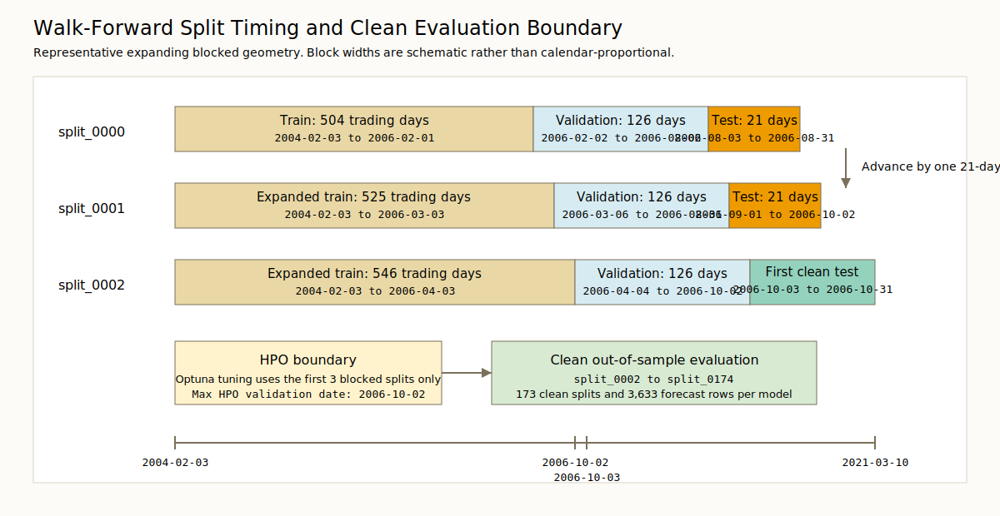

# Leak-Free Next-Session Forecasting of the SPX Implied-Volatility Surface from Raw Cboe 15:45 Option Data

## Abstract

This thesis develops and evaluates a research-grade, leak-free forecasting pipeline for the SPX implied-volatility surface using raw Cboe 15:45 option data. The official sample spans 4,347 trading days from `2004-01-02` through `2021-04-09`. Raw daily `UnderlyingOptionsEODCalcs_*.zip` files are ingested under explicit schema validation, filtered early to the `^SPX` underlying universe, cleaned with logged rule-based quality flags, and transformed into daily 9×9 total-variance surfaces over fixed log-moneyness and maturity grids. The resulting supervised dataset contains 4,325 daily feature rows and 898 columns, with next-observed-session alignment, preserved target-day observed-cell masks, and explicit split manifests. Forecasting is evaluated in an expanding blocked walk-forward design with 175 total splits, of which 173 remain as clean out-of-sample evaluation splits after removing windows contaminated by hyperparameter-tuning validation dates. The benchmark universe includes a no-change surface benchmark (`naive` in code), ridge, elastic net, a HAR/factor benchmark, LightGBM, random forest, and an arbitrage-aware neural model, all trained to predict total variance rather than raw implied volatility.

The main empirical result is unambiguous. On the primary official loss, observed-cell MSE in total variance, the no-change surface benchmark is best with a mean loss of 0.000025, ahead of `har_factor` at 0.000041 and `random_forest` at 0.000069. It is also best on the primary tail-risk profile, with a 95th-percentile loss of 0.000055, and best on the report’s conditional surface-revaluation ranking, with mean absolute revaluation error of 5.729051. The HAR/factor benchmark is the strongest learned model: it delivers the best mean observed-cell QLIKE at 0.024208 and the strongest short-maturity completed-grid gains on the primary metric, improving on `naive` by 46.605807%, 38.749967%, and 21.648583% on the 1-day, 7-day, and 14-day maturity slices. But it does not overturn the primary headline. The arbitrage-aware neural model materially underperforms under the saved Mac CPU profile, with mean observed-cell MSE of 0.002981, mean observed-cell QLIKE of 2,598,062.037716, and tuning diagnostics consistent with severe underprediction. The thesis therefore contributes both infrastructure and evidence: once temporal integrity is enforced, persistence is hard to beat in next-session SPX surface forecasting.

## Introduction

Forecasting the entire implied-volatility surface matters because option valuation, hedging, risk management, and the extraction of option-implied state variables all depend on the joint dynamics of moneyness and maturity rather than on a single volatility summary (Cont and da Fonseca, 2002; Chalamandaris and Tsekrekos, 2010; Ulrich and Walther, 2020). The problem is especially demanding at a one-session horizon, where surface dynamics are highly persistent and random-walk or no-change benchmarks remain empirically serious comparators (Chalamandaris and Tsekrekos, 2010; Kearney, Shang, and Sheenan, 2019; Shang and Kearney, 2022). A credible empirical design therefore has to do two things at once: preserve the causal timeline of the market data and benchmark sophisticated models against strong simple baselines rather than against weak straw men.

This thesis addresses that problem in a deliberately conservative way. It starts from raw daily Cboe option files, fixes the decision timestamp at the 15:45 snapshot, removes same-day end-of-day information from the forecasting problem, constructs daily SPX total-variance surfaces on a fixed grid, and forms next-observed-session targets under explicit split manifests. Working in total-variance space keeps the forecasting object aligned with the surface-construction and arbitrage-geometry literature, while the thesis’s neural specification is described as arbitrage-aware rather than arbitrage-free because it uses soft shape penalties rather than hard no-arbitrage constraints (Gatheral and Jacquier, 2014; Mingone, 2022; Bender and Thiel, 2020). The contribution is therefore not only a forecasting comparison but also an auditable forecasting infrastructure: the raw source files are checksummed in a provenance supplement, while cleaned option panels, observed and completed surfaces, masks, daily features, walk-forward splits, hyperparameter manifests, forecasts, statistical tests, and hedging diagnostics are serialized locally with run manifests and content hashes.

The benchmark set is intentionally broad. It includes a no-change surface benchmark, ridge, elastic net, a HAR-style factor model, tree-based learners, and a flagship arbitrage-aware neural network. This model universe follows three durable lessons from the literature. First, multi-horizon persistence is a natural starting point in volatility forecasting and remains difficult to beat at short horizons (Medvedev and Wang, 2022; Vrontos, Galakis, and Vrontos, 2021). Second, a large share of surface dynamics is often captured by a small number of factors or functional principal components (Cont and da Fonseca, 2002; Chalamandaris and Tsekrekos, 2010; Shang and Kearney, 2022). Third, more recent machine-learning approaches attempt to exploit nonlinear temporal dependence and surface shape through sequence models, coefficient models, and constrained reconstructions, but their gains are empirical rather than guaranteed (Medvedev and Wang, 2022; Zhang, Li, and Zhang, 2023; Chen, Li, and Yu, 2024; Chen, Grith, and Lai, 2026).

The empirical headline is sobering and, for that reason, valuable. Under the official leak-free protocol, the no-change surface benchmark dominates the primary loss ranking, the primary tail-risk ranking, and the official hedging revaluation ranking. The strongest learned competitor is the HAR/factor benchmark, which wins the secondary QLIKE metric and several short-maturity completed-grid slices. The neural model, by contrast, under the saved configuration appears degenerate. The main message of the thesis is therefore not that complexity wins automatically. It is that under a strict timing protocol, persistence remains hard to beat.

Table 1 summarizes the sample, walk-forward geometry, and benchmark universe.

**Table 1. Sample, split, and benchmark summary.**

*Panel A. Data and evaluation sample.*

| Item | Value |
| --- | --- |
| Official sample window | `2004-01-02` through `2021-04-09` |
| Raw daily files processed | `4347` |
| Gold surfaces built | `4347` |
| Supervised feature rows | `4325` |
| Feature columns | `898` |
| Forecast rows per model | `3633` |
| Clean evaluation quote-date range | `2006-10-03` through `2021-03-10` |
| Clean evaluation target-date range | `2006-10-04` through `2021-03-11` |

*Panel B. Walk-forward geometry.*

| Item | Value |
| --- | --- |
| Total serialized splits | `175` |
| HPO tuning splits | `3` |
| First clean evaluation split | `split_0002` |
| Clean evaluation splits | `173` |
| Train size | `504` trading days |
| Validation size | `126` trading days |
| Test size | `21` trading days |
| Step size | `21` trading days |
| Expanding train window | Yes |

*Panel C. Benchmark universe.*

| Model | Description |
| --- | --- |
| `naive` | No-change / persistence benchmark on the completed surface |
| `ridge` | Multi-output ridge regression in log-target space |
| `elasticnet` | Multi-task elastic net in log-target space |
| `har_factor` | PCA factor compression with HAR-style lag structure and ridge mapping |
| `lightgbm` | Gradient-boosted trees on PCA factor targets with early stopping |
| `random_forest` | Multi-output random forest in log-target space |
| `neural_surface` | Flagship arbitrage-aware MLP on the full 81-cell total-variance surface |

## Literature Review

Research on option-implied volatility has long moved beyond scalar indices because the economically relevant object is the surface itself. Daily changes in option values, hedge ratios, and volatility risk depend jointly on moneyness and maturity, and Cont and da Fonseca (2002) show that deformations of the implied-volatility surface can be represented by a small number of interpretable factors with direct risk-management meaning. Chalamandaris and Tsekrekos (2010) make a similar point in forecasting settings, arguing that option prices embed forward-looking volatility information relevant for pricing, hedging, and portfolio management. More recently, Ulrich and Walther (2020) and Ulrich, Zimmer, and Merbecks (2023) show that option-implied quantities such as risk-neutral variance, skewness, and variance risk premia can change materially with the way the surface is constructed. The broader implication is that full-surface forecasting is not a decorative extension of volatility prediction; it is central to how option-implied information is extracted and used.

Once the surface itself is treated as the state variable, representation becomes more than a numerical convenience. A large no-arbitrage literature works in total implied variance, $w(k,T)=\sigma_{BS}^2(k,T)T$, as a function of moneyness and maturity because static-arbitrage restrictions can be expressed cleanly in that space. Gatheral and Jacquier (2014) develop arbitrage-free SVI surfaces and distinguish calendar-spread from butterfly arbitrage; Martini and Mingone (2021) and Mingone (2022) sharpen these conditions for SVI and eSSVI parameterizations; and Bender and Thiel (2020) and Guterding (2023) study arbitrage-free interpolation when only finitely many strikes and maturities are observed. A related recent strand treats smoothing or completion itself as a separate learning problem rather than as trivial preprocessing, using constrained interpolation or learned operators to map irregular option data into dense surfaces (Guterding, 2023; Wiedemann, Jacquier, and Gonon, 2024). For the present thesis, this literature motivates forecasting in total-variance space while also making the terminology discipline clear: a model with soft calendar and convexity penalties is arbitrage-aware, but not arbitrage-free.

On the forecasting side, the enduring empirical regularities are persistence and low-dimensional structure. Cont and da Fonseca (2002) find that a small number of orthogonal factors explain much of the day-to-day deformation of index-option surfaces. Chalamandaris and Tsekrekos (2010) estimate static factors for OTC foreign-exchange surfaces and show that simple vector autoregressions on factor dynamics can improve short-horizon forecasts of the systematic component of the surface, though not uniformly across all surface regions. Kearney, Shang, and Sheenan (2019) report that Nelson-Siegel factors forecast commodity-option surfaces well in rolling out-of-sample tests, and Shang and Kearney (2022) find that dynamic functional principal component methods can outperform functional random-walk and AR(1) benchmarks in foreign-exchange surfaces under expanding-window evaluation. These studies do not eliminate the appeal of simple baselines; rather, they show why no-change, factor, and other linear or low-dimensional models remain the correct first line of comparison.

The same lesson appears in benchmark design. HAR-style multi-horizon structure remains a natural way to encode short-horizon volatility persistence (Corsi, 2009), and Medvedev and Wang (2022) explicitly position HAR-type models as relevant comparators even in full-surface deep-learning exercises. Broader implied-volatility forecasting work outside the full-surface setting likewise continues to compare machine-learning models against penalized, linear, and HAR-type alternatives rather than against weak straw men (Vrontos, Galakis, and Vrontos, 2021; Arratia, El Daou, Kagerhuber, and Smolyarova, 2025). This benchmark discipline matters for the present thesis, whose ridge, elastic net, and HAR/factor models are intended as serious competitors, not as ritual foils.

Recent machine-learning work has nevertheless expanded the feasible model class. Medvedev and Wang (2022) report strong out-of-sample performance of LSTM and ConvLSTM models for multistep forecasts of interpolated SPX surfaces. Zhang, Li, and Zhang (2023) propose a two-step framework that predicts low-dimensional surface features and then reconstructs an arbitrage-free surface with a constrained neural network. Chen, Li, and Yu (2024) show that tree-based prediction of B-spline surface coefficients can outperform both classical parametric and nonparametric benchmarks, while Chen, Grith, and Lai (2026) use a nonlinear functional autoregression with neural tangent kernels to improve forecasts relative to a functional random-walk benchmark. At the same time, Olsen, Djupskås, de Lange, and Risstad (2025) find that rankings can remain sharply maturity-dependent, with LSTM helping at the short end of EURUSD implied volatilities while AR-GARCH remains stronger further out. The balanced reading of this literature is therefore not that machine learning reliably dominates, but that nonlinear gains are possible under some data constructions, maturities, and evaluation criteria.

These divergent findings make evaluation design central rather than secondary. Patton (2011) shows that forecast rankings can be distorted when latent volatility is evaluated using imperfect proxies and derives a class of robust loss functions that includes QLIKE. In a broader implied-volatility forecasting critique, Arratia et al. (2025) show how randomized time-series splits can create data leakage and how familiar performance measures can be misread when target construction is not aligned with the forecasting problem. Cerqueira, Torgo, and Mozetic (2020) similarly show that time-series model evaluation must respect serial dependence and nonstationarity, with blocked or repeated out-of-sample schemes generally more defensible than iid-style resampling in nonstationary settings. In the surface literature itself, rolling or expanding out-of-sample designs and formal comparison procedures are common: Kearney, Shang, and Sheenan (2019) explicitly address the multiple-comparisons problem in rolling forecasts, Shang and Kearney (2022) use an expanding-window design together with Hansen, Lunde, and Nason’s (2011) model confidence set, and Zhang, Li, and Zhang (2023) report Diebold-Mariano comparisons across competing IVS models. Diebold and Mariano (1995) and Hansen (2005) provide the foundational forecast-comparison references underlying these procedures. This literature strongly supports the thesis’s emphasis on leak-free walk-forward evaluation, separated tuning and test periods, and multiple loss summaries rather than a single headline number.

Another methodological lesson is that interpolation, smoothing, and completion can materially alter the empirical object being forecast. Bender and Thiel (2020) emphasize that dense price or volatility surfaces must be reconstructed from finitely observed strikes and maturities. Ulrich and Walther (2020) and Ulrich et al. (2023) show that different surface-construction choices can change extracted option-implied information enough to distort economic conclusions. Recent smoothing and completion papers, including Guterding (2023) and Wiedemann et al. (2024), reinforce the point that dense-surface recovery is itself a substantive modeling task. The implication for this thesis is that it is useful to distinguish between the forecast object and the evaluation scope. Predicting a completed next-session surface is operationally natural, but headline evaluation should still separate performance on genuinely observed target cells from performance on the fully completed grid, because the latter inevitably mixes forecast skill with completion assumptions.

Finally, the literature has not treated economic evaluation as optional. Chalamandaris and Tsekrekos (2010) examine delta-hedged trading implications, and Shang and Kearney (2022) use stylized trading strategies to complement statistical forecast comparisons. Just as important, however, these papers also provide a cautionary template: apparent statistical gains need not survive trading frictions, and performance improvements can be highly localized by region of the surface, by horizon, or by loss function. That makes a negative result scientifically meaningful. A study that enforces a strict 15:45 information set, next-session alignment, leak-free walk-forward evaluation, explicit reproducibility, and strong simple benchmarks is not valuable only if a complex model wins. It is also valuable if those controls reveal that the no-change surface benchmark remains dominant on the primary metric. In that sense, the gap addressed here is narrower but more credible than a generic search for machine-learning outperformance: the contribution is an auditable SPX surface-forecasting pipeline that shows what predictability remains after temporal integrity and benchmark discipline are taken seriously.

## Data

The raw source is the calcs-included Cboe Option EOD Summary daily zip format. The vendor layout note describes the source as a zipped CSV daily summary with a 15:45 snapshot and an end-of-day snapshot for regular trading hours, and it notes that on early-close days the “1545” fields are still named the same even though the effective snapshot is taken at 12:45 ET. The official thesis window is enforced in executable configuration and code as `2004-01-02` through `2021-04-09`. Within that window, the saved run processes 4,347 daily `UnderlyingOptionsEODCalcs_*.zip` files and writes 4,347 bronze parquet files. The refreshed Mac CPU provenance supplement records checksums for those 4,347 raw zips, 4,347 bronze files, 4,347 silver files, 4,347 daily gold surface files, and all seven forecast files used by the canonical report profile.

The thesis universe is defined by `underlying_symbol == "^SPX"`. Importantly, that is an underlying-based definition rather than a root-based one, so it includes both `SPX` and `SPXW` roots whenever they are written on the SPX underlying. This matters because the pipeline later applies root-based settlement conventions to maturity calculation, but it does not exclude weekly contracts simply because they use a different option root.

In the saved run, the raw files conform to one stable 34-column header across all 4,347 daily zips. The repository’s raw schema contract reflects that fact by requiring 21 columns for the core 15:45 forecasting task and permitting 13 additional columns from the vendor layout. This distinction is substantive. The forecasting problem is defined at 15:45, so the pipeline validates the raw header but projects only the needed columns early. Same-day end-of-day OHLC fields, end-of-day quote fields, and other nonessential columns are therefore excluded from the causal forecasting path. This is one of the key ways the pipeline avoids same-day end-of-day leakage.

The vendor layout note is useful for file-format context, but the live files and repository schema contract take precedence whenever vendor documentation and observed data diverge.[^vendor-layout]

[^vendor-layout]: In the saved raw files, the 34-column header is stable across all 4,347 daily zips, but the Cboe layout note is not perfectly faithful to the live data. Two verified examples are that `implied_underlying_price_1545` is populated rather than zero-filled in the observed files, and the note's `bid_eod` description appears to contain an ask-side typo. Consistent with the broader literature on commercial-database discrepancies and replication-sensitive data handling, the paper therefore treats the implemented schema and verified live files as authoritative, while preserving the vendor note only as supplemental documentation (Nobes and Stadler, 2018; Du, Huddart, and Jiang, 2023). These discrepancies do not alter the forecasting design because neither claim is used to define the causal feature set or the headline evaluation results.

Ingestion is intentionally strict. Each zip must contain exactly one CSV member. Dates are parsed with strict typing, schema drift triggers failure, and the symbol filter to `^SPX` is applied at the ingestion stage rather than later in ad hoc analysis. Raw data are treated as immutable, and invalid rows are not silently coerced away. After ingestion, the silver-stage option panel contains 23,827,107 SPX option rows across the sample, of which 18,169,131 survive explicit cleaning. Daily SPX row counts range from 335 to 21,104 with a median of 2,726; daily valid-row counts range from 228 to 18,152 with a median of 1,894.

Cleaning rules are explicit and economically interpretable. The saved configuration requires option type in `{C, P}`, strictly positive bid, ask, and midpoint, ask not below bid, strictly positive implied volatility, strictly positive vega, strictly positive active underlying price, absolute log moneyness no larger than 0.5, and time to maturity between 0.0001 and 2.5 years. Invalid observations are flagged with reason codes such as `NON_POSITIVE_IV`, `NON_POSITIVE_VEGA`, `ASK_LT_BID`, or `OUTSIDE_MONEYNESS_RANGE`, rather than being dropped without trace.

Timing conventions are central. The effective decision timestamp is 15:45 America/New_York on regular sessions and 15 minutes before the scheduled close on early-close sessions. Time to maturity is computed from that effective decision timestamp to the contract’s last tradable session close under explicit settlement rules: `SPX` is treated as AM-settled, while `SPXW` and other roots are treated as PM-settled unless configured otherwise. This is not a cosmetic detail. It determines the maturity coordinate used both in surface construction and in total-variance conversion.

## Surface Construction and Interpolation

The option-level panel is transformed into derived quantities at the decision snapshot. For each valid row, the repository computes the 15:45 midpoint and spread, log moneyness as `log(strike) - log(active_underlying_price_1545)`, and total variance as `implied_volatility_1545^2 × tau_years`. The use of `active_underlying_price_1545` is deliberate. It is the underlying price used in the vendor calculation model and is also the project’s official daily spot source for later hedging work. The forecasting target is therefore constructed directly in total-variance space, not in raw implied volatility.

Daily surfaces are built on a fixed 9×9 grid. The log-moneyness grid is `[-0.30, -0.20, -0.10, -0.05, 0.00, 0.05, 0.10, 0.20, 0.30]`, and the maturity grid in calendar days is `[1, 7, 14, 30, 60, 90, 180, 365, 730]`. Each valid option row is assigned to the nearest maturity and moneyness cell by midpoint binning. Within each cell, the repository aggregates observations using vega-weighted averages. In particular, observed total variance and observed implied volatility are both vega-weighted, and the saved surface also retains the cell-level vega sum, weighted spread, and observation count. A cell is marked as observed when its observation count is at least 1.

This observed/completed distinction is fundamental. The saved gold surface artifacts contain both the sparse observed surface and the dense completed surface. Across the 4,347 gold surfaces in the official run, the total number of observed cells is 277,737. The number of observed cells per day ranges from 37 to 81, with a median of 65. Completed surfaces, by construction, always have all 81 cells. That sparsity makes interpolation unavoidable, but it also motivates preserving the observed-cell mask so that evaluation can later distinguish between genuinely observed target regions and cells created entirely by completion.

Surface completion is deterministic and takes place in total-variance space. The canonical procedure is sequential one-dimensional interpolation using monotone piecewise cubic Hermite interpolation. The saved configuration applies interpolation first along the maturity axis and then along the moneyness axis, repeating that sequence for 2 cycles. Outside the observed range on a given axis, the nearest boundary value is carried forward rather than extrapolated with a new slope. Any remaining values are rejected, and the finished completed surface is floored at `1.0e-8` in total variance. Implied-volatility surfaces used for reporting are derived only after this step through the identity `IV = sqrt(total_variance / tau)`. The project does not interpolate raw implied volatility directly.

In the official run, every in-window trading day produced a gold surface. That matters for later alignment. The code path can handle missing post-cleaning days and records them explicitly, but in the saved thesis artifacts there are no skipped in-window gold-surface dates.

Table 2 reports the fixed grid and the minimum coverage facts needed to interpret the forecasting object. The larger row-count totals remain in the saved report artifacts.

**Table 2. Fixed grid and observed-cell coverage.**

| Item | Value |
| --- | --- |
| Underlying universe | `underlying_symbol == "^SPX"` |
| Log-moneyness grid | `[-0.30, -0.20, -0.10, -0.05, 0.00, 0.05, 0.10, 0.20, 0.30]` |
| Maturity grid (days) | `[1, 7, 14, 30, 60, 90, 180, 365, 730]` |
| Grid size | `9 x 9 = 81` cells |
| Interpolation order and cycles | `maturity -> moneyness`, `2` cycles |
| Total-variance floor | `1.0e-8` |
| Observed cells per day | min `37`, median `65`, max `81` |
| Completed cells per day | always `81` |

## Feature Engineering and Targets

The supervised dataset is built from the time-ordered gold surfaces. Each row corresponds to one quote date, and the target date is the next observed gold-surface date. Because the official run produces a gold surface on every in-window trading session, the next observed gold-surface date coincides with the next trading session throughout the saved sample. The repository still records `target_gap_sessions` explicitly so that any future skipped-session behavior would remain visible downstream rather than being hidden by the alignment logic.

Feature construction uses only information available by the quote-date decision timestamp. The lag windows are 1, 5, and 22 trading sessions. For each window, the pipeline computes the equal-weight mean of the completed surface over the previous window and, separately, the mean of the observed-cell mask over that window. In addition, it includes the one-day change in the completed surface between the current and previous quote dates. The daily liquidity block contains four controls: coverage ratio, daily vega sum, daily option count, and the daily vega-weighted 15:45 spread. These choices are consistent with the literature’s emphasis on multi-horizon persistence and low-dimensional surface state variables (Cont and da Fonseca, 2002; Chalamandaris and Tsekrekos, 2010; Shang and Kearney, 2022).

Targets are stored separately and explicitly. Every supervised row includes the next-session completed target surface in total variance, the next-session observed-cell mask, the next-session vega weights, and target-side training weights. These training weights are especially important for the neural model. Observed target cells retain their positive target-day vega weights, while completed-only cells receive unit weight so that a nonzero imputed-cell loss can be applied without collapsing those cells to zero weight.

The resulting daily feature file spans quote dates from `2004-02-03` through `2021-04-08` and target dates from `2004-02-04` through `2021-04-09`. It contains 4,325 rows and 898 columns. The reduction from 4,347 gold surfaces to 4,325 supervised rows is exactly what the design implies: a 22-session warm-up for the longest lag window and the loss of the final date as a target-less terminal observation.

A subtle but important point is that the project forecasts the completed next-session surface for every model, not just for the neural model. The observed-cell mask is preserved alongside that completed target and is used later to define the official evaluation slices. This prevents an apples-to-oranges comparison in which some models are trained on dense surfaces but judged against sparse, model-specific observed subsets.

## Models

The model universe is fixed by design rather than chosen after seeing results. It contains the no-change surface benchmark (`naive` in code and artifacts), ridge, elastic net, a HAR/factor model, LightGBM, random forest, and a flagship arbitrage-aware neural surface model. All models forecast next-session total variance, not raw implied volatility. This choice is methodological as well as practical: total variance is the space in which the surface is completed and the space in which the static-shape penalties are defined (Gatheral and Jacquier, 2014; Bender and Thiel, 2020; Mingone, 2022).

The no-change surface benchmark is deliberately simple and deliberately strong. It forecasts tomorrow’s completed surface as today’s lag-1 completed surface, cell by cell. There is no parameter learning beyond verifying that the lag-1 feature block aligns exactly with the target layout. In this thesis, that model is not a sanity check; it is the official benchmark.

The linear baselines are multi-output ridge and multi-task elastic net regressions on the daily feature matrix. Both standardize features within the fit window, transform strictly positive total-variance targets into log space, and invert predictions back to total variance after fitting. They are intended to test whether simple shrinkage on a high-dimensional but structured feature matrix can outperform surface persistence.

The HAR/factor benchmark compresses the surface into a small number of principal components and then applies a HAR-style structure in factor space. Specifically, it projects the next-session completed target surface, and the lag-1, lag-5, and lag-22 completed surfaces, into PCA factors fitted inside the training window. A ridge regression then maps lagged factor summaries to next-session factor scores, and the surface is reconstructed by inverse transformation. In the saved 30-trial HPO run, the selected configuration uses 9 factors and ridge penalty `alpha = 6.644070263467316`.

The tree benchmarks test whether nonlinear predictors can exploit interactions that the linear models miss. The random forest model is a multi-output forest fitted to the daily feature matrix in log-target space. The LightGBM benchmark is more structured: it projects targets to PCA factor space and fits one gradient-boosted tree model per factor, with validation-aware early stopping. In the saved run, the selected LightGBM configuration uses 400 trees, learning rate `0.11962323112686886`, maximum depth 3, `num_leaves = 21`, and 9 PCA factors. The selected random forest configuration uses 400 trees, maximum depth 10, and `min_samples_leaf = 1`.

The flagship neural model is a compact multilayer perceptron that predicts the full 81-cell total-variance surface jointly. Its hidden layers use GELU activations and dropout, and its output passes through a softplus transformation plus an explicit positive total-variance floor. The training objective is a weighted surface MSE on the completed target surface, with separate weights for observed and completed-only cells and with target-side cell weights carried from the data pipeline. On top of that supervised loss, the model adds soft penalties for three surface-shape properties: calendar monotonicity across maturities, strike-space call-price convexity implied by the nonuniform moneyness grid, and local roughness. These are diagnostics and penalties, not hard constraints. The model is therefore arbitrage-aware, not arbitrage-free (Medvedev and Wang, 2022; Zhang, Li, and Zhang, 2023; Gatheral and Jacquier, 2014; Mingone, 2022). In the saved official run, the selected neural configuration uses hidden width 384, depth 2, dropout `0.10712118850586368`, learning rate `0.00422336970502679`, batch size 128, and small penalty weights.

The saved official hyperparameters are reported in Appendix Table A1 and are also pinned down by the serialized tuning artifacts. They are fixed before the clean evaluation sample is summarized in the results that follow.

The report artifacts cited in the tables and figures use run profile `hpo_30_trials__train_30_epochs__mac_cpu`. This profile reruns the raw-to-feature chain from `/Volumes/T9/Options Data`, regenerates all seven model forecasts in the Mac profile directory, and recomputes stages 07 through 09. The local Mac LightGBM forecast is generated with a no-OpenMP LightGBM 4.6.0 build and `n_jobs = 1`, which avoids the native OpenMP-runtime conflict observed with the stock macOS wheel. The profile also records `data/manifests/forecast_profile_reuse/mac_cpu.json`, whose `reused_models` list is empty for the refreshed canonical Mac run.

## Walk-Forward Design, Tuning, and Evaluation

The forecasting design is an expanding blocked walk-forward procedure. The saved split configuration uses 504 trading days for training, 126 for validation, 21 for testing, and a step size of 21 trading days. Applied to the 4,325-row supervised sample, this produces 175 explicit serialized splits from `split_0000` through `split_0174`. The first split’s validation window runs from `2006-02-02` through `2006-08-02`, and the last split’s test window runs from `2021-02-09` through `2021-03-10`.

Hyperparameter tuning is separated from final evaluation by construction. The official HPO profile uses 30 Optuna trials, a TPE sampler, and a median pruner, and it tunes on the first 3 blocked splits only. The primary optimization criterion is `observed_mse_total_variance`. Those first 3 tuning splits imply a maximum HPO validation date of `2006-10-02`. Clean evaluation then begins at `split_0002`, whose test window starts on `2006-10-03`, strictly after the last HPO-used validation date. This leaves 173 clean evaluation splits. In other words, the tuning sample is not defined abstractly; it is pinned down by saved split manifests and by an explicit date boundary.

The distinction between training and validation also matters inside each walk-forward fit. For the models without validation-aware early stopping—`naive`, ridge, elastic net, HAR/factor, and random forest—the repository refits on the combined train-plus-validation window before generating test forecasts. For the validation-aware models—LightGBM and the neural network—the validation block is retained as a true validation slice for early stopping or checkpoint selection on each split. In all cases, preprocessing objects are fit inside the relevant training window only. Standardization, PCA factorization, and neural feature normalization do not see future rows before prediction.

Forecast artifacts are produced only for the clean evaluation sample. Each model generates 3,633 forecast rows, spanning quote dates from `2006-10-03` through `2021-03-10` and target dates from `2006-10-04` through `2021-03-11`. Those artifacts are then aligned to two realized states: the target-day surface and the origin-day surface. That alignment allows the evaluation code to compute both level errors and implied-volatility changes.

The primary official loss is `observed_mse_total_variance`. It evaluates the predicted completed target surface against the realized completed target surface on the cells that are actually observed on the target day, using target-day vega weights. The secondary official loss is `observed_qlike_total_variance`. It uses the same target-day observed-cell mask, but it is not vega-weighted; it is computed as an unweighted QLIKE average over the observed target cells subject to the configured positive floor. This distinction matters because the thesis’s headline result is anchored to the weighted observed-cell MSE criterion, while the secondary result reflects a different loss geometry on the same observed target region. Supplementary completed-grid metrics use all 81 completed cells, with uniform weights for weighted losses and simple averaging for QLIKE.

Statistical forecast comparison follows the saved configuration: pairwise Diebold-Mariano tests (Diebold and Mariano, 1995) with alternative `"greater"` and max lag 0, a block-bootstrap superior predictive ability test (Hansen, 2005) with block size 5, 500 bootstrap repetitions, and alpha 0.10, and a simplified Tmax-style model confidence set with the same block size, repetition count, and alpha (Hansen, Lunde, and Nason, 2011; Kearney, Shang, and Sheenan, 2019; Shang and Kearney, 2022; Zhang, Li, and Zhang, 2023). QLIKE uses a positive floor of `1.0e-8` in total variance (Patton, 2011).

Economic evaluation is implemented through a standardized one-session revaluation and hedging exercise. The project builds a synthetic option book combining an at-the-money straddle exposure, a skew exposure via `±0.10` log-moneyness strikes, and calendar spreads between 30-day and 90-day maturities. Hedge ratios are chosen with an underlying position and a 30-day at-the-money straddle under a naive spot assumption for next-day sizing. All revaluation uses Black-Scholes pricing on completed surfaces. For SPX, the daily spot is taken from the median valid `active_underlying_price_1545`, not from vendor underlying bid/ask fields, because those bid/ask fields can legitimately be zero for index underlyings in the raw source.

Figure 1 illustrates the walk-forward timing geometry.

## Results

### Primary loss performance

The primary result is clear. On the official observed-cell MSE metric in total variance, the no-change surface benchmark (`naive`) ranks first with mean loss 0.000025. The closest challengers are `har_factor` at 0.000041 and `random_forest` at 0.000069. The remaining models are materially worse, and the log-scaled normalization in Figure 2 makes clear that the gap widens rapidly once one moves beyond those two challengers.

The persistence result is not driven by a few lucky days. Derived from the saved daily loss frame, `naive` beats `har_factor` on 3,395 of 3,633 target dates, `random_forest` on 3,336 days, `lightgbm` on 3,503 days, `elasticnet` on 3,349 days, and `neural_surface` on 3,631 days. Even `ridge`, which occasionally looks competitive on isolated days, is still worse than `naive` on 3,243 of 3,633 days and loses the average by an enormous margin because of catastrophic outliers. A supplementary aggregation of the same saved daily loss frame also leaves `naive` first on mean completed-grid MSE, so the headline is not an artifact of restricting attention to observed cells.

The tail-risk evidence points in the same direction. On the primary metric, `naive` has the best 95th-percentile daily loss at 0.000055, compared with 0.000145 for `har_factor`, 0.000216 for `random_forest`, 0.000834 for `lightgbm`, 0.000183 for `elasticnet`, 0.009927 for `neural_surface`, and 0.000170 for `ridge`. `har_factor` and `random_forest` occasionally produce slightly smaller worst single-day losses than `naive`, but they do so while being materially worse at the 90th, 95th, and 99th percentiles. The primary worst-day drilldown reinforces this asymmetry: `naive`’s maximum loss is 0.009466, whereas `neural_surface` reaches 0.034380 and `ridge` reaches 7,312.550531.

The broader saved comparison tests agree with the ranking. On the primary metric, the block-bootstrap SPA test against the challenger set returns `p = 0.586`, with no superior models by mean. The simplified Tmax model confidence set retains only `naive` at alpha 0.10. Those saved test artifacts support a strong conclusion: within the official leak-free design, no challenger overturns the no-change surface benchmark on the primary loss.

Figure 2 visualizes the primary ranking.

**Figure 2. Mean observed-cell MSE by model, normalized to `naive = 1` and shown on a log scale.**

Table 4 reports a compressed primary tail-risk summary.

**Table 4. Primary tail-risk summary for `observed_mse_total_variance`.**

| rank | model_name | mean_loss | p95_loss | p99_loss | max_loss |
| --- | --- | --- | --- | --- | --- |
| 1 | naive | 0.000025 | 0.000055 | 0.000281 | 0.009466 |
| 2 | har_factor | 0.000041 | 0.000145 | 0.000410 | 0.008825 |
| 3 | random_forest | 0.000069 | 0.000216 | 0.000980 | 0.008827 |
| 4 | lightgbm | 0.000273 | 0.000834 | 0.006338 | 0.018725 |
| 5 | elasticnet | 0.000631 | 0.000183 | 0.002774 | 0.460190 |
| 6 | neural_surface | 0.002981 | 0.009927 | 0.016812 | 0.034380 |
| 7 | ridge | 2.014039 | 0.000170 | 0.008059 | 7312.550531 |

### Secondary metric and slice behavior

The secondary metric tells a more nuanced story. On observed-cell QLIKE in total variance, the HAR/factor benchmark (`har_factor`) ranks first with mean loss 0.024208. It is followed by `random_forest` at 0.029269, `elasticnet` at 0.034404, `lightgbm` at 0.057431, `ridge` at 1.345556, `naive` at 9.447580, and `neural_surface` at 2,598,062.037716. On this metric, the strongest learned model is therefore not merely competitive but decisively ahead in the mean.

That mean, however, must be interpreted carefully. `har_factor` does not dominate `naive` day by day. It improves on `naive` on 1,692 of 3,633 target dates and loses on 1,941. The reason the mean nonetheless favors `har_factor` is that `naive` has a handful of very large QLIKE blowups. Its 95th-percentile QLIKE is only 0.061089, but its maximum daily QLIKE reaches 13,624.020964. By contrast, `har_factor` has a 95th percentile of 0.048626 and a maximum of 1.607816. The saved worst-day table shows that the largest `naive` QLIKE episodes occur late in the sample, including target dates `2021-03-02` and `2021-02-25`.

The statistical evidence for the secondary story is therefore favorable but less decisive than the primary MSE result. Pairwise Diebold-Mariano tests comparing `naive` to individual challengers produce `p = 0.037912` against `har_factor` and similarly small p-values against several other challengers, which is consistent with lower mean QLIKE for those models. The simplified Tmax confidence set retains `har_factor` on the secondary metric. But the SPA test against the full challenger set returns `p = 0.102`, just above the configured alpha of 0.10. The safest interpretation is that the QLIKE evidence is favorable to `har_factor`, but less decisive than the primary MSE result in favor of `naive`.

Slice-level results sharpen that interpretation. On the primary metric, `har_factor` posts the best completed-grid maturity-slice losses at the short end: 0.000027 on the 1-day slice versus 0.000050 for `naive`, 0.000009 versus 0.000015 at 7 days, and 0.000006 versus 0.000007 at 14 days. Those correspond to improvements of 46.605807%, 38.749967%, and 21.648583%. Outside that short end, `naive` owns the remaining completed-grid maturity slices. In observed-scope maturity slices, `random_forest` takes only the 1-day slice, with an 11.999788% improvement over `naive`; `naive` is best on the remaining observed-scope maturity slices. On the secondary metric, `har_factor` leads most short-maturity slices and many moneyness slices, while `naive` retains the long end and much of the observed-scope grid. The slice evidence therefore suggests that the learned models are not uniformly useless; it suggests something narrower and more interesting: short-maturity surface dynamics contain forecastable structure, especially under QLIKE and especially for HAR-style factor summaries. That structure is simply not strong enough, in the saved design, to dislodge persistence as the best overall model on the primary thesis metric.

The cell-level heatmap makes that localization explicit. Under the primary observed-cell MSE criterion, `naive` is the best model in 58 of 81 cells. `har_factor` and `random_forest` each win 10 cells, while `lightgbm` wins only 3 isolated cells. The gains are therefore real, but they are sparse and concentrated rather than surface-wide.

Figure 3 summarizes the cell-level pattern.

**Figure 3. Best-performing model by cell on the 9x9 maturity-by-moneyness grid under observed-cell MSE. Cell fill shows percent improvement versus `naive`; cell text shows the winning model.**

Figure 4 summarizes the slice-level patterns.

**Figure 4. Maturity-slice and moneyness-slice performance.**

*Panel A. Observed-cell WRMSE by maturity slice.*

*Panel B. Observed-cell WRMSE by moneyness slice.*

### Hedging performance, arbitrage diagnostics, and the neural model

The hedging results again put `naive` first on the report’s official ranking metric, mean absolute conditional surface-revaluation error. `naive` records 5.729051, followed by `har_factor` at 6.353638, `random_forest` at 7.898828, `lightgbm` at 10.075435, `ridge` at 13.087057, `elasticnet` at 13.671021, and `neural_surface` at 96.935700. On this stylized measure, which revalues surfaces using the realized target-day spot, the no-change surface benchmark is also strongest.

There is one secondary nuance. `har_factor` produces slightly smaller mean absolute hedged PnL than `naive`—2.837992 versus 2.877114—and slightly smaller mean squared hedged PnL—19.927431 versus 20.091176. That is an interesting signal that the HAR/factor benchmark may improve some hedge-stability aspects even when it loses the official revaluation ranking. But it does not reverse the main economic result, because the report’s headline hedging criterion is mean absolute revaluation error, and on that criterion `naive` remains first.

The saved diagnostics also clarify why the neural model must be described as arbitrage-aware rather than arbitrage-free. Out of sample, `neural_surface` is poor on every major scoreboard: mean observed-cell MSE 0.002981, mean observed-cell QLIKE 2,598,062.037716, mean absolute conditional surface-revaluation error 96.935700. Its tuning diagnostics are consistent with collapse toward near-zero predictions: among completed tuning split rows, the median selected metric is 0.0009463360888203731, the median prediction-to-target mean ratio is 0.04517458404633791, the median share of predictions below `1e-6` is 0.6775426219870664, and the median selected best epoch is 2. In plain language, the model often settles very early into extremely small surface forecasts.

The arbitrage-diagnostic summary reinforces the distinction between soft awareness and hard guarantees. Using the corrected nonuniform-grid, price-convexity diagnostic, `neural_surface` averages 6.809524 calendar-monotonicity violations and 0.074869 butterfly-convexity violations per forecast surface. The corresponding magnitudes are 0.000157 and 0.024715. By contrast, `naive` averages 3.646023 calendar violations and 3.307459 convexity violations, while the actual completed surfaces average 3.513228 and 3.377042. The neural penalties therefore reduce price-convexity violation counts, but they still do not produce hard arbitrage-freeness or rescue forecast accuracy. Appendix Table A2 reports the full arbitrage-diagnostic summary.

Table 5 reports the compressed hedging ranking.

**Table 5. Ranked hedging summary.**

| rank | model_name | mean_abs_revaluation_error | improvement_vs_benchmark_pct |
| --- | --- | --- | --- |
| 1 | naive | 5.729051 | 0.000000 |
| 2 | har_factor | 6.353638 | -10.902102 |
| 3 | random_forest | 7.898828 | -37.873220 |
| 4 | lightgbm | 10.075435 | -75.865683 |
| 5 | ridge | 13.087057 | -128.433226 |
| 6 | elasticnet | 13.671021 | -138.626267 |
| 7 | neural_surface | 96.935700 | -1592.002645 |

## Discussion and Limitations

The central empirical lesson is that temporal integrity is not a side issue. It is the result. Once the forecasting problem is defined as “15:45 information only, next observed session target, no same-day end-of-day leakage,” the no-change surface benchmark becomes extremely difficult to beat. That is not a disappointing side note; it is the main scientific finding of the saved artifacts. Any future model for this problem should be judged first against this persistence baseline and only second against other learned competitors.

The HAR/factor benchmark is the clearest positive exception. It does not win the primary ranking, but it does win the secondary QLIKE metric, it dominates several short-maturity slices, and it ranks second on the official hedging revaluation summary. That pattern is economically plausible. A factor model with multi-horizon lag structure is well suited to a one-session horizon in which most of the surface is persistent but the front end can still move sharply. The saved results suggest that future work should treat HAR-style structure not as a weak classical foil but as a serious benchmark in its own right.

The neural result is negative in a more substantive sense. The saved configuration does not merely fall short of first place; it looks unhealthy. The combination of median best epoch equal to 2, median prediction-to-target ratio around 0.045, and a 67.8% share of predictions below `1e-6` strongly suggests underprediction or collapse. Because QLIKE is extremely punitive when predicted total variance is too close to zero, that collapse naturally explodes the secondary loss. The arbitrage-penalty summary adds another caution: soft penalties can make a model arbitrage-aware without making it arbitrage-free; here, lower price-convexity violation counts coexist with very poor statistical and revaluation performance. A better future neural design would likely need more than different hyperparameters. It would probably require a different output parameterization, a better-calibrated loss, or a stronger structural inductive bias.

The completed-surface representation is another important limitation. Every model is trained and scored against completed total-variance surfaces, and the official observed-cell metrics restrict headline evaluation to the locations that were genuinely observed on the target day. That is a sensible compromise, but it does not make interpolation disappear. The actual completed surfaces themselves exhibit calendar and convexity violations on average, which means the “truth” used in evaluation is already a model-based completion of sparse quotes. Appendix Figure A1 makes the interpolation sensitivity visible: reversing the interpolation order yields a mean RMSE difference of 0.003225 across 4,347 quote dates, and the worst-day maximum absolute cell difference is 1.407986. Most days are much less sensitive than that, but sparse or irregular days can still move materially under alternate completion rules.

The scope of the study is also intentionally narrow. It concerns one underlying (`^SPX`), one decision timestamp (15:45 ET), one forecast horizon (the next observed trading session), and one fixed 9×9 grid. The feature set is deliberately endogenous, built from lagged surfaces, masks, and liquidity summaries rather than from macro variables, realized-volatility measures, or order-flow features. The hedging exercise is stylized as well: it uses Black-Scholes revaluation on completed surfaces, assumes zero risk-free rate, sizes hedges under a naive spot assumption, and omits transaction costs. None of those choices invalidate the comparison, but all of them limit how far the results can be generalized.

A final limitation is interpretive. The official run does not encounter skipped in-window gold-surface days after cleaning. That is good news for data quality, but it means the saved headline results do not stress-test the branch of the alignment logic that handles missing gold sessions through positive `target_gap_sessions`. The infrastructure supports that case. The thesis results simply do not need it.

## Conclusion

This thesis builds auditable, leak-free 15:45 SPX implied-volatility-surface forecasting infrastructure from raw Cboe option data. The pipeline enforces the official sample window in code, filters early to the SPX universe, constructs total-variance surfaces with preserved observed-cell masks, serializes walk-forward split manifests, and evaluates a fixed benchmark universe under both statistical and hedging criteria. In that sense, the thesis’s contribution is methodological as much as predictive.

Empirically, the message is straightforward. The no-change surface benchmark is best on the primary official loss, best on primary tail risk, and best on the official hedging revaluation ranking. The strongest learned alternative is the HAR/factor benchmark, which wins the secondary QLIKE metric and several short-maturity completed-grid slices but does not overturn the persistence result. The arbitrage-aware neural model, under the saved configuration, underperforms badly and does not produce hard-arbitrage-free forecasts.

The practical implication is disciplined rather than flashy. Future work should not try to bypass the persistence result with looser timing assumptions or with benchmark selection after the fact. It should preserve the same causal discipline and ask a harder question: what genuinely new information, available by 15:45, can improve on the next-session SPX surface beyond simple persistence? Until that question is answered convincingly, the no-change benchmark remains the model to beat.

## References

Arratia, A., M. El Daou, J. Kagerhuber, and Y. Smolyarova. 2025. "Examining challenges in implied volatility forecasting: A critical review of data leakage and feature engineering combined with high-complexity models." Computational Economics. https://doi.org/10.1007/s10614-025-11172-z.

Bender, C., and M. Thiel. 2020. "Arbitrage-free interpolation of call option prices." Statistics & Risk Modeling 37(1-2): 55-78. https://doi.org/10.1515/strm-2018-0026.

Cerqueira, V., L. Torgo, and I. Mozetic. 2020. "Evaluating time series forecasting models: an empirical study on performance estimation methods." Machine Learning 109: 1997-2028. https://doi.org/10.1007/s10994-020-05910-7.

Chalamandaris, G., and A. E. Tsekrekos. 2010. "Predictable dynamics in implied volatility surfaces from OTC currency options." Journal of Banking & Finance 34: 1175-1188. https://doi.org/10.1016/j.jbankfin.2009.11.014.

Chen, Y., M. Grith, and H. L. H. Lai. 2026. "Neural tangent kernel in implied volatility forecasting: A nonlinear functional autoregression approach." Journal of Business & Economic Statistics 44(1): 24-38. https://doi.org/10.1080/07350015.2025.2489087.

Chen, Z., Y. Li, and C. L. Yu. 2024. "Modeling implied volatility surface using B-splines with time-dependent coefficients predicted by tree-based machine learning methods." Mathematics 12: 1100. https://doi.org/10.3390/math12071100.

Cont, R., and J. da Fonseca. 2002. "Dynamics of implied volatility surfaces." Quantitative Finance 2(1): 45-60. https://doi.org/10.1088/1469-7688/2/1/304.

Corsi, F. 2009. "A simple approximate long-memory model of realized volatility." Journal of Financial Econometrics 7(2): 174-196. https://doi.org/10.1093/jjfinec/nbp001.

Diebold, F. X., and R. S. Mariano. 1995. "Comparing predictive accuracy." Journal of Business & Economic Statistics 13(3): 253-263. https://doi.org/10.1080/07350015.1995.10524599.

Du, K., S. Huddart, and X. Jiang. 2023. "Lost in standardization: Effects of financial statement database discrepancies on inference." Journal of Accounting and Economics 76(1): Article 101573. https://doi.org/10.1016/j.jacceco.2022.101573.

Gatheral, J., and A. Jacquier. 2014. "Arbitrage-free SVI volatility surfaces." Quantitative Finance 14(1): 59-71. https://doi.org/10.1080/14697688.2013.819986.

Guterding, D. 2023. "Sparse modeling approach to the arbitrage-free interpolation of plain-vanilla option prices and implied volatilities." Risks 11: 83. https://doi.org/10.3390/risks11050083.

Hansen, P. R. 2005. "A test for superior predictive ability." Journal of Business & Economic Statistics 23(4): 365-380. https://doi.org/10.1198/073500105000000063.

Hansen, P. R., A. Lunde, and J. M. Nason. 2011. "The model confidence set." Econometrica 79(2): 453-497. https://doi.org/10.3982/ecta5771.

Kearney, F., H. L. Shang, and L. Sheenan. 2019. "Implied volatility surface predictability: The case of commodity markets." Journal of Banking & Finance 108: 105657. https://doi.org/10.1016/j.jbankfin.2019.105657.

Martini, C., and A. Mingone. 2021. "Explicit no-arbitrage domain for sub-SVIs via reparametrization." arXiv preprint arXiv:2106.02418. https://doi.org/10.48550/arXiv.2106.02418.

Medvedev, N., and Z. Wang. 2022. "Multistep forecast of the implied volatility surface using deep learning." Journal of Futures Markets 42: 645-667. https://doi.org/10.1002/fut.22302.

Mingone, A. 2022. "No-arbitrage global parametrization for the eSSVI volatility surface." Quantitative Finance 22(12): 2205-2217. https://doi.org/10.1080/14697688.2022.2117076.

Nobes, C., and C. Stadler. 2018. "Investigating international differences in financial reporting: Data problems and some proposed solutions." The British Accounting Review 50(6): 602-614. https://doi.org/10.1016/j.bar.2018.09.002.

Olsen, A., G. Djupskås, P. E. de Lange, and M. Risstad. 2025. "Forecasting implied volatilities of currency options with machine learning techniques and econometrics models." International Journal of Data Science and Analytics 20: 1329-1347. https://doi.org/10.1007/s41060-024-00528-7.

Patton, A. J. 2011. "Volatility forecast comparison using imperfect volatility proxies." Journal of Econometrics 160: 246-256. https://doi.org/10.1016/j.jeconom.2010.03.034.

Shang, H. L., and F. Kearney. 2022. "Dynamic functional time-series forecasts of foreign exchange implied volatility surfaces." International Journal of Forecasting 38(3): 1025-1049. https://doi.org/10.1016/j.ijforecast.2021.07.011.

Ulrich, M., and S. Walther. 2020. "Option-implied information: What's the vol surface got to do with it?" Review of Derivatives Research 23: 323-355. https://doi.org/10.1007/s11147-020-09166-0.

Ulrich, M., L. Zimmer, and C. Merbecks. 2023. "Implied volatility surfaces: a comprehensive analysis using half a billion option prices." Review of Derivatives Research 26: 135-169. https://doi.org/10.1007/s11147-023-09195-5.

Vrontos, S. D., J. Galakis, and I. D. Vrontos. 2021. "Implied volatility directional forecasting: a machine learning approach." Quantitative Finance 21(10): 1687-1706. https://doi.org/10.1080/14697688.2021.1905869.

Wiedemann, R., A. Jacquier, and L. Gonon. 2024. "Operator deep smoothing for implied volatility." arXiv preprint arXiv:2406.11520. https://doi.org/10.48550/arXiv.2406.11520.

Zhang, W., L. Li, and G. Zhang. 2023. "A two-step framework for arbitrage-free prediction of the implied volatility surface." Quantitative Finance 23(1): 21-34. https://doi.org/10.1080/14697688.2022.2135454.

## Appendix

Appendix material collects reproducibility-heavy tables and diagnostics that matter for auditability but do not merit main-text space.

**Appendix Table A1. Tuned hyperparameters used in the saved official run.**

*Panel A. Persistence, linear, factor, and tree models.*

| Model | Stage-05 best value | Selected hyperparameters |
| --- | --- | --- |
| `naive` | n/a | Lag-1 completed-surface carry-forward |
| `ridge` | `0.00011775166321408725` | `alpha=97.2956052631225` |
| `elasticnet` | `0.00011115214657925672` | `alpha=0.06673358872570778`; `l1_ratio=0.8537754503645` |
| `har_factor` | `0.00011388628600664281` | `n_factors=9`; `alpha=6.644070263467316` |
| `lightgbm` | `0.00012129157327578915` | `n_estimators=400`; `learning_rate=0.11962323112686886`; `num_leaves=21`; `max_depth=3`; `min_child_samples=20`; `feature_fraction=0.8655344460953254`; `lambda_l2=0.1024333825675971`; `n_factors=9` |
| `random_forest` | `0.00012688219090806608` | `n_estimators=400`; `max_depth=10`; `min_samples_leaf=1` |

*Panel B. Neural model.*

| Model | Stage-05 best value | Selected hyperparameters |
| --- | --- | --- |
| `neural_surface` | `0.0009101158672406145` | `hidden_width=384`; `depth=2`; `dropout=0.10712118850586368`; `learning_rate=0.00422336970502679`; `weight_decay=5.138298522573402e-05`; `batch_size=128`; `calendar_penalty_weight=0.006503132708010469`; `convexity_penalty_weight=1.0627295606594362e-05`; `roughness_penalty_weight=0.00035852333027431416` |

**Appendix Table A2. Arbitrage-diagnostic summary.**

| model_name | mean_calendar_violation_count | mean_calendar_violation_magnitude | mean_convexity_violation_count | mean_convexity_violation_magnitude | n_surfaces |
| --- | --- | --- | --- | --- | --- |
| neural_surface | 6.809524 | 0.000157 | 0.074869 | 0.024715 | 3633 |
| random_forest | 2.646023 | 0.000338 | 2.229012 | 0.374859 | 3633 |
| lightgbm | 4.124140 | 0.000516 | 2.133774 | 0.131781 | 3633 |
| har_factor | 4.128269 | 0.000620 | 2.608863 | 0.408626 | 3633 |
| naive | 3.646023 | 0.005406 | 3.307459 | 1.310745 | 3633 |
| actual_surface | 3.513228 | 0.006529 | 3.377042 | 1.692889 | 4347 |
| elasticnet | 4.268373 | 0.015412 | 2.568951 | 3.653552 | 3633 |
| ridge | 6.306083 | 0.275690 | 3.331131 | 7.057413 | 3633 |

**Appendix Figure A1. Empirical CDF of daily interpolation-order RMSE differences.**

