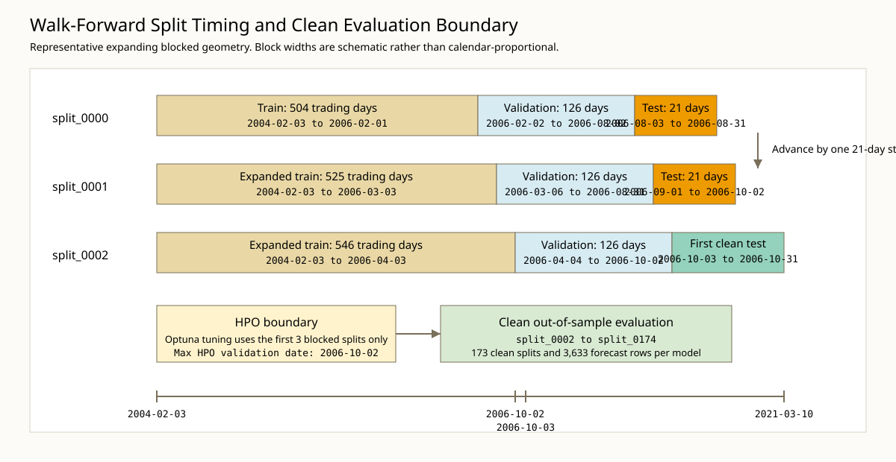

# Persistence and Predictability in the SPX Implied-Volatility Surface: A Leak-Free Forecast Evaluation

## Abstract

This thesis develops and evaluates a research-grade, leak-free forecasting pipeline for the SPX implied-volatility surface using raw Cboe 15:45 option data. The official sample spans 4,347 trading days from `2004-01-02` through `2021-04-09`. Raw daily `UnderlyingOptionsEODCalcs_*.zip` files are ingested under explicit schema validation, filtered early to the `^SPX` underlying universe, cleaned with logged rule-based quality flags, and transformed into daily 9×9 total-variance surfaces over fixed log-moneyness and maturity grids. The resulting supervised dataset contains 4,325 daily feature rows and 906 columns, with next-observed-session alignment, preserved target-day observed-cell masks, and explicit split manifests. Forecasting is evaluated in an expanding blocked walk-forward design with 175 total splits, of which 173 remain as clean out-of-sample evaluation splits after removing windows contaminated by hyperparameter-tuning validation dates. The benchmark universe includes a no-change surface benchmark (`naive` in code), ridge, elastic net, a HAR/factor benchmark, LightGBM, random forest, and an arbitrage-aware neural model, all trained to predict total variance rather than raw implied volatility.

The main empirical result has two parts. On the primary official loss, observed-cell MSE in total variance, the no-change surface benchmark has the lowest mean loss, 1.8081e-05, but the HAR/factor benchmark is statistically tied with it at 1.8598e-05 (Diebold-Mariano `p = 0.57`; both are retained in the model confidence set), and `random_forest` follows at 4.4855e-05. Persistence also has the lowest 95th-percentile primary loss (3.185e-05) and the best conditional surface-revaluation error (5.083). On the secondary observed-cell QLIKE loss the ranking reverses: `har_factor` (0.0912), `random_forest` (0.0939), and `elasticnet` (0.0949) all beat persistence (0.1529) with Diebold-Mariano `p < 1e-7`, an SPA p-value near zero, and persistence eliminated from the model confidence set. The arbitrage-aware neural model ranks fourth on the primary loss (5.5722e-05) with the fewest calendar-arbitrage violations, but it extrapolates poorly in crisis periods. The thesis therefore contributes both infrastructure and evidence: once temporal integrity is enforced, persistence is unbeaten on the primary loss, but it is matched by a HAR-style factor model and beaten under QLIKE. That headline sharpens, at a stricter intraday information set, a pattern running from early coefficient-based SPX surface forecasting (Gonçalves and Guidolin, 2006) to recent evidence that a ridge-regularized linear model on lagged implied volatilities outperforms nonlinear machine-learning alternatives out of sample (Wen, Zhai, Wang, and Cao, 2024).

## Introduction

Forecasting the entire implied-volatility surface matters because option valuation, hedging, risk management, and the extraction of option-implied state variables all depend on the joint dynamics of moneyness and maturity rather than on a single volatility summary (Cont and da Fonseca, 2002; Chalamandaris and Tsekrekos, 2010; Ulrich and Walther, 2020). The problem is especially demanding at a one-session horizon, where surface dynamics are highly persistent and random-walk or no-change benchmarks remain empirically serious comparators (Chalamandaris and Tsekrekos, 2010; Kearney, Shang, and Sheenan, 2019; Shang and Kearney, 2022). A credible empirical design therefore has to do two things at once: preserve the causal timeline of the market data and benchmark sophisticated models against strong simple baselines rather than against weak straw men.

This thesis addresses that problem in a deliberately conservative way. It starts from raw daily Cboe option files, fixes the decision timestamp at the 15:45 snapshot, removes same-day end-of-day information from the forecasting problem, constructs daily SPX total-variance surfaces on a fixed grid, and forms next-observed-session targets under explicit split manifests. Working in total-variance space keeps the forecasting object aligned with the surface-construction and arbitrage-geometry literature (Gatheral and Jacquier, 2014; Mingone, 2022; Bender and Thiel, 2020), while the thesis’s neural specification is described as arbitrage-aware rather than arbitrage-free because it uses soft shape penalties rather than hard no-arbitrage constraints. The contribution is therefore not only a forecasting comparison but also an auditable forecasting infrastructure: the raw source files are checksummed in a provenance supplement, while cleaned option panels, observed and completed surfaces, masks, daily features, walk-forward splits, hyperparameter manifests, forecasts, statistical tests, and hedging diagnostics are serialized locally with run manifests and content hashes.

The benchmark set is intentionally broad. It includes a no-change surface benchmark, ridge, elastic net, a HAR-style factor model, tree-based learners, and a flagship arbitrage-aware neural network. This model universe follows three durable lessons from the literature. First, multi-horizon persistence is a natural starting point in volatility forecasting (Corsi, 2009), random-walk benchmarks remain difficult to beat at short horizons (Shang and Kearney, 2022; Chen, Grith, and Lai, 2026), and simple linear models of past implied volatilities are hard to improve on (Wen, Zhai, Wang, and Cao, 2024). Second, a large share of surface dynamics is often captured by a small number of factors or functional principal components (Cont and da Fonseca, 2002; Chalamandaris and Tsekrekos, 2010; Shang and Kearney, 2022). Third, more recent machine-learning approaches attempt to exploit nonlinear temporal dependence and surface shape through sequence models, coefficient models, and constrained reconstructions, but their gains are empirical rather than guaranteed (Medvedev and Wang, 2022; Zhang, Li, and Zhang, 2023; Chen, Li, and Yu, 2024; Chen, Grith, and Lai, 2026).

The empirical headline is sobering and, for that reason, valuable. Under the official leak-free protocol, the no-change surface benchmark has the lowest primary loss, the lowest primary tail risk, and the best stylized-revaluation result, but the HAR/factor benchmark is statistically tied with it on the primary loss. On the secondary QLIKE loss, the HAR/factor benchmark, the random forest, and the elastic net beat persistence decisively. The neural model is a credible fourth on the primary loss. The main message of the thesis is therefore not that complexity wins automatically. It is that under a strict timing protocol, persistence remains hard to beat on the primary loss, and that simple factor dynamics are what it takes to match it. That conclusion has direct antecedents: statistically predictable SPX surface dynamics have been documented since Gonçalves and Guidolin (2006) without translating into robust economic gains, and Wen et al. (2024) report that ridge regressions on lagged implied volatilities outperform nonlinear machine-learning models for S&P 500 options. The marginal claim here is therefore not that simplicity wins, but that the result survives a stricter, fully audited 15:45 information-set protocol with the surface itself as the forecast object.

Table 1 summarizes the sample, walk-forward geometry, and benchmark universe.

**Table 1. Sample, split, and benchmark summary.**

*Panel A. Data and evaluation sample.*

| Item | Value |
| --- | --- |
| Official sample window | `2004-01-02` through `2021-04-09` |
| Raw daily files processed | `4347` |
| Gold surfaces built | `4347` |
| Supervised feature rows | `4325` |
| Feature columns | `906` |
| Forecast target dates per model | `3,633` |
| Forecast cell rows per model | `294,273` |
| Clean evaluation quote-date range | `2006-10-03` through `2021-03-10` |
| Clean evaluation target-date range | `2006-10-04` through `2021-03-11` |

*Panel B. Walk-forward geometry.*

| Item | Value |
| --- | --- |
| Total serialized splits | `175` |
| HPO tuning splits | `3` |
| First clean evaluation split | `split_0002` |
| Clean evaluation splits | `173` |
| Train size | `504` trading days |
| Validation size | `126` trading days |
| Test size | `21` trading days |
| Step size | `21` trading days |
| Expanding train window | Yes |

*Panel C. Benchmark universe.*

| Model | Description |
| --- | --- |
| `naive` | No-change / persistence benchmark on the completed surface |
| `ridge` | Multi-output ridge regression in log-target space |
| `elasticnet` | Multi-task elastic net in log-target space |
| `har_factor` | PCA factor compression with HAR-style lag structure and ridge mapping |
| `lightgbm` | Gradient-boosted trees on PCA factor targets with early stopping |
| `random_forest` | Multi-output random forest in log-target space |
| `neural_surface` | Flagship arbitrage-aware MLP on the full 81-cell total-variance surface |

## Literature Review

Research on option-implied volatility has long moved beyond scalar indices because the economically relevant object is the surface itself. Daily changes in option values, hedge ratios, and volatility risk depend jointly on moneyness and maturity, and Cont and da Fonseca (2002) show that deformations of the implied-volatility surface can be represented by a small number of interpretable factors with direct risk-management meaning. Chalamandaris and Tsekrekos (2010) make a similar point in forecasting settings, arguing that option prices embed forward-looking volatility information relevant for pricing, hedging, and portfolio management. More recently, Ulrich and Walther (2020) show that risk-neutral variance and variance-risk-premium estimates can change materially with the way the surface is constructed, and Ulrich, Zimmer, and Merbecks (2023) find the same for risk-neutral moments such as skewness. The broader implication is that full-surface forecasting is not a decorative extension of volatility prediction; it is central to how option-implied information is extracted and used.

Once the surface itself is treated as the state variable, representation becomes more than a numerical convenience. A large no-arbitrage literature works in total implied variance, $w(k,T)=\sigma_{BS}^2(k,T)T$, as a function of moneyness and maturity because static-arbitrage restrictions can be expressed cleanly in that space. Gatheral and Jacquier (2014) develop arbitrage-free SVI surfaces and distinguish calendar-spread from butterfly arbitrage; Martini and Mingone (2021) and Mingone (2022) sharpen these conditions for SVI and eSSVI parameterizations; Bender and Thiel (2020) study arbitrage-free interpolation when only finitely many strikes and maturities are observed; and Guterding (2023) studies it across finitely many strikes at a single maturity. A related recent strand treats smoothing or completion itself as a separate learning problem rather than as trivial preprocessing, using constrained interpolation or learned operators to map irregular option data into dense smiles or surfaces (Guterding, 2023; Wiedemann, Jacquier, and Gonon, 2025). For the present thesis, this literature motivates forecasting in total-variance space while also making the terminology discipline clear: a model with soft calendar and convexity penalties is arbitrage-aware, but not arbitrage-free.

On the forecasting side, the enduring empirical regularities are persistence and low-dimensional structure. Cont and da Fonseca (2002) find that a small number of orthogonal factors explain much of the day-to-day deformation of index-option surfaces. Gonçalves and Guidolin (2006) model daily S&P 500 surface coefficients with vector autoregressions and find statistically predictable dynamics whose apparent economic value is fragile once realistic trading costs are considered, and Bernales and Guidolin (2014) extend coefficient-based surface forecasting to individual equity options, again separating statistical predictability from net economic gains. Chalamandaris and Tsekrekos (2010) estimate static factors for OTC foreign-exchange surfaces and show that simple vector autoregressions on factor dynamics can improve short-horizon forecasts of the systematic component of the surface, though not uniformly across all surface regions. Kearney, Shang, and Sheenan (2019) report that Nelson-Siegel factors forecast commodity-option surfaces well in rolling out-of-sample tests, and Shang and Kearney (2022) find that dynamic functional principal component methods can outperform functional random-walk and AR(1) benchmarks in foreign-exchange surfaces under expanding-window evaluation. These studies do not eliminate the appeal of simple baselines; rather, they show why no-change, factor, and other linear or low-dimensional models remain the correct first line of comparison.

The same lesson appears in benchmark design. HAR-style multi-horizon structure remains a natural way to encode short-horizon volatility persistence (Corsi, 2009), and Chen, Grith, and Lai (2026) carry daily, weekly, and monthly surface lags into a full-surface forecasting model. Broader implied-volatility forecasting work outside the full-surface setting likewise continues to compare machine-learning models against linear, penalized, and parametric alternatives rather than against weak straw men (Vrontos, Galakis, and Vrontos, 2021; Arratia, El Daou, Kagerhuber, and Smolyarova, 2026). Wen, Zhai, Wang, and Cao (2024) push this discipline to its sharpest recent conclusion: for S&P 500 and SSE 50 ETF options, a ridge (L2-regularized) regression on the past 20 days of implied volatilities consistently outperforms nonlinear machine-learning benchmarks out of sample, although by a modest margin. That result is the closest published precedent for the headline pattern in this thesis, and it makes clear that the finding "regularized simple models win" is not itself novel; what this thesis adds is the demonstration that the pattern survives at a stricter intraday information set, with the full surface as the forecast object and with the completion machinery held explicitly separate from forecast skill. This benchmark discipline matters for the present thesis, whose ridge, elastic net, and HAR/factor models are intended as serious competitors, not as ritual foils.

Recent machine-learning work has nevertheless expanded the feasible model class. Audrino and Colangelo (2010) provide an early template, correcting a parametric surface forecast with boosted regression trees on S&P 500 data, and Cao, Chen, and Hull (2020) model SPX implied-volatility movements with a feedforward network conditioned on return, moneyness, and maturity information. Medvedev and Wang (2022) report that a ConvLSTM outperforms VAR and VEC benchmarks at every horizon from 1 to 90 days in forecasts of an interpolated SPX surface over a 90-day 2019 test period, while a plain LSTM underperforms both linear benchmarks. Zhang, Li, and Zhang (2023) propose a two-step framework that predicts low-dimensional surface features and then reconstructs the surface with a neural network trained under static-arbitrage penalties, which the authors note makes it almost, rather than exactly, free of static arbitrage. Chen, Li, and Yu (2024) show that tree-based prediction of B-spline surface coefficients can outperform both classical parametric and nonparametric benchmarks, while Chen, Grith, and Lai (2026) use a nonlinear functional autoregression with neural tangent kernels to improve on a functional random-walk benchmark at horizons of 5 to 20 days, though not one day ahead. At the same time, Olsen, Djupskås, de Lange, and Risstad (2025) find that rankings can remain sharply maturity-dependent, with LSTM helping at the short end of EURUSD implied volatilities while AR-GARCH remains stronger further out. The balanced reading of this literature is therefore not that machine learning reliably dominates, but that nonlinear gains are possible under some data constructions, maturities, and evaluation criteria.

These divergent findings make evaluation design central rather than secondary. Patton (2011) shows that forecast rankings can be distorted when latent volatility is evaluated using imperfect proxies and derives a class of robust loss functions that includes QLIKE. In a broader implied-volatility forecasting critique, Arratia et al. (2026) show how randomized time-series splits can create data leakage and how familiar performance measures can be misread when target construction is not aligned with the forecasting problem. Cerqueira, Torgo, and Mozetič (2020) similarly show that time-series model evaluation should respect serial dependence and nonstationarity: in nonstationary settings, repeated out-of-sample holdouts estimate performance most accurately and iid-style cross-validation least accurately, while blocked cross-validation suits stationary series. In the surface literature itself, rolling or expanding out-of-sample designs and formal comparison procedures are common: Kearney, Shang, and Sheenan (2019) explicitly address the multiple-comparisons problem in rolling forecasts, Shang and Kearney (2022) use an expanding-window design together with Hansen, Lunde, and Nason’s (2011) model confidence set, and Zhang, Li, and Zhang (2023) report Diebold-Mariano comparisons across competing IVS models. Diebold and Mariano (1995) and Hansen (2005) provide the foundational forecast-comparison references underlying these procedures. This literature strongly supports the thesis’s emphasis on leak-free walk-forward evaluation, separated tuning and test periods, and multiple loss summaries rather than a single headline number.

Another methodological lesson is that interpolation, smoothing, and completion can materially alter the empirical object being forecast. Bender and Thiel (2020) emphasize that dense price or volatility surfaces must be reconstructed from finitely observed strikes and maturities. Ulrich and Walther (2020) and Ulrich et al. (2023) show that different surface-construction choices can change extracted option-implied information enough to distort economic conclusions. Fengler's (2009) arbitrage-free smoothing splines made dense-surface recovery an explicit modeling problem early, and recent smoothing and completion papers, including Guterding (2023) for single-maturity smiles and Wiedemann et al. (2025) for full surfaces, reinforce the point that dense-surface recovery is itself a substantive modeling task. The implication for this thesis is that it is useful to distinguish between the forecast object and the evaluation scope. Predicting a completed next-session surface is operationally natural, but headline evaluation should still separate performance on genuinely observed target cells from performance on the fully completed grid, because the latter inevitably mixes forecast skill with completion assumptions.

Finally, the literature has not treated economic evaluation as optional. Chalamandaris and Tsekrekos (2010) examine delta-hedged trading implications, and Shang and Kearney (2022) use stylized trading strategies to complement statistical forecast comparisons. Just as important, however, these papers also provide a cautionary template: apparent statistical gains need not survive trading frictions, and performance improvements can be highly localized by region of the surface, by horizon, or by loss function. That makes a negative result scientifically meaningful. A study that enforces a strict 15:45 information set, next-session alignment, leak-free walk-forward evaluation, explicit reproducibility, and strong simple benchmarks is not valuable only if a complex model wins. It is also valuable if those controls reveal that the no-change surface benchmark remains dominant on the primary metric. In that sense, the gap addressed here is narrower but more credible than a generic search for machine-learning outperformance: the contribution is an auditable SPX surface-forecasting pipeline that shows what predictability remains after temporal integrity and benchmark discipline are taken seriously.

## Data

The raw source is the calcs-included Cboe Option EOD Summary daily zip format. The vendor layout note describes the source as a zipped CSV daily summary with a 15:45 snapshot and an end-of-day snapshot for regular trading hours, and it notes that on early-close days the “1545” fields are still named the same even though the effective snapshot is taken at 12:45 ET. The official thesis window is enforced in executable configuration and code as `2004-01-02` through `2021-04-09`. Within that window, the saved run processes 4,347 daily `UnderlyingOptionsEODCalcs_*.zip` files and writes 4,347 bronze parquet files. The Windows/CUDA run manifests record the git commit and content hashes for the generated forecast, statistical, hedging, and report artifacts.

The thesis universe is defined by `underlying_symbol == "^SPX"`. Importantly, that is an underlying-based definition rather than a root-based one, so it includes both `SPX` and `SPXW` roots whenever they are written on the SPX underlying. This matters because the pipeline later applies root-based settlement conventions to maturity calculation, but it does not exclude weekly contracts simply because they use a different option root.

In the saved run, the raw files conform to one stable 34-column header across all 4,347 daily zips. The repository’s raw schema contract reflects that fact by requiring 21 columns for the core 15:45 forecasting task and permitting 13 additional columns from the vendor layout. This distinction is substantive. The forecasting problem is defined at 15:45, so the pipeline validates the raw header but projects only the needed columns early. Same-day end-of-day OHLC fields, end-of-day quote fields, and other nonessential columns are therefore excluded from the causal forecasting path. This is one of the key ways the pipeline avoids same-day end-of-day leakage.

The vendor layout note is useful for file-format context, but the live files and repository schema contract take precedence whenever vendor documentation and observed data diverge.[^vendor-layout]

[^vendor-layout]: In the saved raw files, the 34-column header is stable across all 4,347 daily zips, but the Cboe layout note is not perfectly faithful to the live data. Two verified examples are that `implied_underlying_price_1545` is populated rather than zero-filled in the observed files, and the note's `bid_eod` description appears to contain an ask-side typo. Because commercial databases can contain errors that only checks against the underlying data reveal (Nobes and Stadler, 2018), the paper relies on the verified live files and the schema implemented from them, and keeps the vendor note only as supplemental documentation. These discrepancies do not alter the forecasting design because neither claim is used to define the causal feature set or the headline evaluation results.

Ingestion is intentionally strict. Each zip must contain exactly one CSV member. Dates are parsed with strict typing, schema drift triggers failure, and the symbol filter to `^SPX` is applied at the ingestion stage rather than later in ad hoc analysis. Raw data are treated as immutable, and invalid rows are not silently coerced away. After ingestion, the silver-stage option panel contains 23,827,107 SPX option rows across the sample, of which 18,181,369 survive explicit cleaning. Daily SPX row counts range from 335 to 21,104 with a median of 2,726; daily valid-row counts range from 228 to 18,152 with a median of 1,901. The placeholder rules reject 2,058,233 rows with sentinel volatilities and 1,360 rows quoted 998/999.

Cleaning rules are explicit and economically interpretable. The saved configuration requires option type in `{C, P}`, strictly positive bid, ask, and midpoint, ask not below bid, strictly positive implied volatility, strictly positive vega, strictly positive active underlying price, absolute log moneyness no larger than 0.5, and time to maturity between 0.0001 and 2.5 years. It also rejects vendor placeholder values that are not market observations: the bid/ask pair 998/999, which marks a missing market in 2004–2007, and implied volatilities of exactly 0.02 and 0.001, which are solver sentinels written for deep in-the-money contracts whose implied volatility could not be solved (0.02 alone appears on 2.06 million raw rows, against at most about 7,600 for any other exact value). Invalid observations are flagged with reason codes such as `NON_POSITIVE_IV`, `NON_POSITIVE_VEGA`, `ASK_LT_BID`, `PLACEHOLDER_IMPLIED_VOLATILITY`, or `OUTSIDE_MONEYNESS_RANGE`, rather than being dropped without trace.

Timing conventions are central. The effective decision timestamp is 15:45 America/New_York on regular sessions and 15 minutes before the scheduled close on early-close sessions. Time to maturity is computed from that effective decision timestamp to the contract’s settlement instant: the 09:30 ET opening of the settlement session for AM-settled contracts and that session’s close for PM-settled contracts. AM-settled roots are `SPX`, the original SPX Weeklys `JXA`, `JXB`, `JXD`, and `JXE` (Cboe circular IC05-138), and the 24 alternate roots under which standard SPX monthlies and LEAPS were listed before the 2010 symbology change (for example `SPT`, `SPQ`, `SXZ`, and `SZP`; every one carries only Saturday standard expirations in the archive). `SPXW` and the quarterly roots are PM-settled. This maturity is the coordinate used for surface construction. Total variance is a separate quantity: it must reproduce the quoted option price, so it is computed with the maturity the vendor used when it solved the implied volatility. That maturity is recoverable from the vendor’s own Greeks, because vega divided by gamma equals `S^2 × IV × tau` for any rates and dividends; the vendor references `SPX`-root contracts to 09:30 ET on the settlement session and every other root to the session close. This is not a cosmetic detail: an `SPX` total variance built from a maturity that ends at the prior session’s close would be understated by about 42% at a one-day horizon.

## Surface Construction and Interpolation

The option-level panel is transformed into derived quantities at the decision snapshot. For each valid row, the repository computes the 15:45 midpoint and spread, log moneyness against one daily 15:45 spot, and total variance as `implied_volatility_1545^2 × tau_vendor`. The daily spot is the vendor’s `active_underlying_price_1545`, the underlying price used in the vendor calculation model, and is also the project’s official daily spot source for the later revaluation work. On five sessions (2020-08-10 through 2020-08-14) the vendor reports that field per expiration as a carry-adjusted price; the nearest expiration carries the spot, so the daily spot is taken from the nearest expiration. The forecasting target is therefore constructed directly in total-variance space, not in raw implied volatility.

One coordinate convention deserves emphasis. The moneyness measure is spot log-moneyness: no forward or discount adjustment is applied, and the pipeline carries no risk-free or dividend term structure. The static-arbitrage literature states its conditions in forward log-moneyness, so the surface-shape penalties and diagnostics used later are approximations whose quality degrades as maturity grows and the forward-spot gap widens; over 2004-2021 the gap is negligible at the front of the maturity grid but can approach the near-the-money grid spacing at the 365- and 730-day nodes. The populated vendor field `implied_underlying_price_1545` offers a natural forward proxy for future refinement, but it is not used in the saved run.

Daily surfaces are built on a fixed 9×9 grid. The log-moneyness grid is `[-0.30, -0.20, -0.10, -0.05, 0.00, 0.05, 0.10, 0.20, 0.30]`, and the maturity grid in calendar days is `[1, 7, 14, 30, 60, 90, 180, 365, 730]`. Each valid option row inside the grid domain (log-moneyness within ±0.30 and maturity between 1 and 730 days) is assigned to the nearest maturity and moneyness cell by midpoint binning; valid rows outside that domain are recorded with a grid-domain reason and not used. Within each cell, the repository aggregates observations using vega-weighted averages. Because a maturity bin spans contracts from well below to well above its node (the 30-day node collects maturities from 22 to 45 days), each row’s total variance is first expressed at the node maturity under a locally constant implied volatility, `total_variance × tau_node / tau`; the cell value is then the vega-weighted average, so a cell holds total variance at its grid maturity rather than a mix of maturities. Observed implied volatility is the vega-weighted average of the rows’ implied volatilities, and the saved surface also retains the cell-level vega sum, weighted spread, and observation count. A cell is marked as observed when its observation count is at least 1.

This observed/completed distinction is fundamental. The saved gold surface artifacts contain both the sparse observed surface and the dense completed surface. Across the 4,347 gold surfaces in the official run, the total number of observed cells is 274,180. The number of observed cells per day ranges from 36 to 81, with a median of 64. Completed surfaces, by construction, always have all 81 cells. That sparsity makes interpolation unavoidable, but it also motivates preserving the observed-cell mask so that evaluation can later distinguish between genuinely observed target regions and cells created entirely by completion.

Surface completion is deterministic and takes place in total-variance space. The canonical procedure is sequential one-dimensional interpolation using monotone piecewise cubic Hermite interpolation. The saved configuration applies interpolation first along the maturity axis and then along the moneyness axis, repeating that sequence for 2 cycles. Outside the observed range on a given axis, the nearest boundary value is carried forward rather than extrapolated with a new slope. Along moneyness the boundary total variance is carried forward, which holds implied volatility flat at a fixed maturity. Along maturity the boundary implied volatility is carried forward, so total variance scales with maturity; carrying total variance itself would imply that all variance accrues before the shortest observed maturity, and would set an unobserved one-day implied volatility to between √7 and √14 times the observed seven- or fourteen-day level. Any remaining values are rejected, and the finished completed surface is floored at `1.0e-8` in total variance. Implied-volatility surfaces used for reporting are derived only after this step through the identity `IV = sqrt(total_variance / tau)`. The project does not interpolate raw implied volatility directly.

In the official run, every in-window trading day produced a gold surface. That matters for later alignment. The code path can handle missing post-cleaning days and records them explicitly, but in the saved thesis artifacts there are no skipped in-window gold-surface dates.

Table 2 reports the fixed grid and the minimum coverage facts needed to interpret the forecasting object. The larger row-count totals remain in the saved report artifacts.

**Table 2. Fixed grid and observed-cell coverage.**

| Item | Value |
| --- | --- |
| Underlying universe | `underlying_symbol == "^SPX"` |
| Log-moneyness grid | `[-0.30, -0.20, -0.10, -0.05, 0.00, 0.05, 0.10, 0.20, 0.30]` |
| Maturity grid (days) | `[1, 7, 14, 30, 60, 90, 180, 365, 730]` |
| Grid size | `9 x 9 = 81` cells |
| Interpolation order and cycles | `maturity -> moneyness`, `2` cycles |
| Boundary fill | flat implied volatility along maturity; flat total variance along moneyness |
| Cell value | vega-weighted total variance expressed at the node maturity |
| Total-variance floor | `1.0e-8` |
| Observed cells per day | min `36`, median `64`, max `81` |
| Completed cells per day | always `81` |

## Feature Engineering and Targets

The supervised dataset is built from the time-ordered gold surfaces. Each row corresponds to one quote date, and the target date is the next observed gold-surface date. Because the official run produces a gold surface on every in-window trading session, the next observed gold-surface date coincides with the next trading session throughout the saved sample. The repository still records `target_gap_sessions` explicitly so that any future skipped-session behavior would remain visible downstream rather than being hidden by the alignment logic.

Feature construction uses only information available by the quote-date decision timestamp. The lag windows are 1, 5, and 22 trading sessions. For each window, the pipeline computes the equal-weight mean of the completed surface over the previous window and, separately, the mean of the observed-cell mask over that window. In addition, it includes the one-day change in the completed surface between the current and previous quote dates. The daily liquidity block contains four controls: coverage ratio, daily vega sum, daily option count, and the daily vega-weighted 15:45 spread. The 1-, 5-, and 22-session windows follow the daily, weekly, and monthly structure of HAR models (Corsi, 2009), and the design is consistent with evidence that surface dynamics are persistent and largely captured by a few factors (Cont and da Fonseca, 2002; Chalamandaris and Tsekrekos, 2010; Shang and Kearney, 2022).

Targets are stored separately and explicitly. Every supervised row includes the next-session completed target surface in total variance, the next-session observed-cell mask, the next-session vega weights, and target-side training weights. These training weights are especially important for the neural model. Observed target cells retain their positive target-day vega weights, while completed-only cells receive unit weight so that a nonzero imputed-cell loss can be applied without collapsing those cells to zero weight.

The resulting daily feature file spans quote dates from `2004-02-03` through `2021-04-08` and target dates from `2004-02-04` through `2021-04-09`. It contains 4,325 rows and 906 columns. The reduction from 4,347 gold surfaces to 4,325 supervised rows reflects the 22-session lag window first becoming available at position 21, requiring 21 prior sessions plus the current quote session, and the loss of the final target-less observation.

A subtle but important point is that the project forecasts the completed next-session surface for every model, not just for the neural model. The observed-cell mask is preserved alongside that completed target and is used later to define the official evaluation slices. This prevents an apples-to-oranges comparison in which some models are trained on dense surfaces but judged against sparse, model-specific observed subsets.

## Models

The model universe is fixed by design rather than chosen after seeing results. It contains the no-change surface benchmark (`naive` in code and artifacts), ridge, elastic net, a HAR/factor model, LightGBM, random forest, and a flagship arbitrage-aware neural surface model. All models forecast next-session total variance, not raw implied volatility. This choice is methodological as well as practical: total variance is the space in which the surface is completed and the space in which the static-shape penalties are defined, as in the total-variance arbitrage conditions of Gatheral and Jacquier (2014) and Mingone (2022) and the maturity interpolation of Bender and Thiel (2020).

The no-change surface benchmark is deliberately simple and deliberately strong. It forecasts tomorrow’s completed surface as today’s lag-1 completed surface, cell by cell. There is no parameter learning beyond verifying that the lag-1 feature block aligns exactly with the target layout. In this thesis, that model is not a sanity check; it is the official benchmark.

The linear baselines are multi-output ridge and multi-task elastic net regressions on the daily feature matrix. Both standardize features within the fit window, transform strictly positive total-variance targets into log space, and invert predictions back to total variance after fitting. They are intended to test whether simple shrinkage on a high-dimensional but structured feature matrix can outperform surface persistence.

The HAR/factor benchmark compresses the surface into a small number of principal components and then applies a HAR-style structure in factor space. Specifically, it projects the next-session completed target surface, and the lag-1, lag-5, and lag-22 completed surfaces, into PCA factors fitted inside the training window. A ridge regression then maps lagged factor summaries to next-session factor scores, and the surface is reconstructed by inverse transformation. In the saved 30-trial HPO run, the selected configuration uses 12 factors and ridge penalty `alpha = 0.1702061398957051`.

The tree benchmarks test whether nonlinear predictors can exploit interactions that the linear models miss. The random forest model is a multi-output forest fitted to the daily feature matrix in log-target space. The LightGBM benchmark is more structured: it projects targets to PCA factor space and fits one gradient-boosted tree model per factor, with validation-aware early stopping. In the saved run, the selected LightGBM configuration uses 300 trees, learning rate `0.03255485563410355`, maximum depth 5, `num_leaves = 45`, and 11 PCA factors. The selected random forest configuration uses 300 trees, maximum depth 10, and `min_samples_leaf = 1`.

The flagship neural model is a compact multilayer perceptron that predicts the full 81-cell total-variance surface jointly. Its hidden layers use GELU activations and dropout, and its output passes through a softplus transformation, expressed in units of the training window’s mean target total variance, plus an explicit positive total-variance floor. The scale matters numerically: total variance is of order 1e-4 to 1e-2 while a freshly initialized softplus head emits values of order one, and without the scale the first optimizer steps drive the head into saturation, where gradients vanish and every forecast collapses onto the floor. The training objective is divided by the squared scale, which leaves its minimizers unchanged. The training objective is a weighted surface MSE on the completed target surface, with separate weights for observed and completed-only cells and with target-side cell weights carried from the data pipeline. On top of that supervised loss, the model adds soft penalties for three surface-shape properties: calendar monotonicity across maturities, strike-space call-price convexity implied by the nonuniform moneyness grid, and local roughness. The convexity penalty acts on normalized Black-Scholes call prices reconstructed from the predicted total-variance surface, under a zero-rate, spot-moneyness normalization; combined with the coordinate caveat in the surface-construction section, the penalties approximate rather than reproduce the forward-space no-arbitrage conditions. These are diagnostics and penalties, not hard constraints. The model is therefore arbitrage-aware, not arbitrage-free (Zhang, Li, and Zhang, 2023; Gatheral and Jacquier, 2014; Mingone, 2022). In the saved official run, the selected neural configuration uses hidden width 192, depth 5, dropout `0.20075012893143274`, learning rate `0.0015489264694749072`, batch size 32, and small penalty weights.

The saved official hyperparameters are reported in Appendix Table A1 and are also pinned down by the serialized tuning artifacts. They are fixed before the clean evaluation sample is summarized in the results that follow.

The report artifacts cited in the tables and figures use run profile `hpo_30_trials__train_30_epochs`. This profile runs the raw-to-report chain from `D:\Options Data` on Windows/CUDA, regenerates all seven model forecasts, and recomputes stages 07 through 09. Every stage manifest of the run records the same git commit, so the reported artifacts are tied to the committed code state used for the end-to-end run.

## Walk-Forward Design, Tuning, and Evaluation

The forecasting design is an expanding blocked walk-forward procedure. The saved split configuration uses 504 trading days for training, 126 for validation, 21 for testing, and a step size of 21 trading days. The 504-day figure is the initial training size, not a rolling-window width: with `expanding_train` enabled, every subsequent split trains on all data from the start of the sample, so the training window genuinely expands. Applied to the 4,325-row supervised sample, this produces 175 explicit serialized splits from `split_0000` through `split_0174`. The first split’s validation window runs from `2006-02-02` through `2006-08-02`, and the last split’s test window runs from `2021-02-09` through `2021-03-10`.

Hyperparameter tuning is separated from final evaluation by construction. The official HPO profile uses 30 Optuna trials, a TPE sampler, and a median pruner, and it tunes on the first 3 blocked splits only. The primary optimization criterion is `observed_mse_total_variance`. Those first 3 tuning splits imply a maximum HPO validation date of `2006-10-02`. Clean evaluation then begins at `split_0002`, whose test window starts on `2006-10-03`, strictly after the last HPO-used validation date. This leaves 173 clean evaluation splits. In other words, the tuning sample is not defined abstractly; it is pinned down by saved split manifests and by an explicit date boundary.

The distinction between training and validation also matters inside each walk-forward fit. For the models without validation-aware early stopping—`naive`, ridge, elastic net, HAR/factor, and random forest—the repository refits on the combined train-plus-validation window before generating test forecasts. For the validation-aware models—LightGBM and the neural network—the validation block is retained as a true validation slice for early stopping or checkpoint selection on each split. In all cases, preprocessing objects are fit inside the relevant training window only. Standardization, PCA factorization, and neural feature normalization do not see future rows before prediction.

Forecast artifacts are produced only for the clean evaluation sample. Each model generates 3,633 forecast surfaces, stored as 294,273 cell rows, spanning quote dates from `2006-10-03` through `2021-03-10` and target dates from `2006-10-04` through `2021-03-11`. Those artifacts are then aligned to two realized states: the target-day surface and the origin-day surface. That alignment allows the evaluation code to compute both level errors and implied-volatility changes.

The primary official loss is `observed_mse_total_variance`. It evaluates the predicted completed target surface against the realized completed target surface on the cells that are actually observed on the target day, using target-day vega weights. Because the target day's observed mask and vega weights are unknown at the 15:45 decision time, this is an ex-post marking-relevance estimand — how well the forecast marks the cells that turn out to be observed and vega-important on the target day — rather than an ex-ante decision loss whose weights are fixed at the forecast origin. This is not predictor leakage, since the weights enter only after the forecast is made, but it does mean the primary metric describes ex-post marking accuracy rather than the loss faced by a decision maker at the origin. The secondary official loss is `observed_qlike_total_variance`. It uses the same target-day observed-cell mask, but it is not vega-weighted; it is computed as an unweighted QLIKE average over the observed target cells subject to the configured positive floor. This distinction matters because the thesis’s headline result is anchored to the weighted observed-cell MSE criterion, while the secondary result reflects a different loss geometry on the same observed target region. Supplementary completed-grid metrics use all 81 completed cells, with uniform weights for weighted losses and simple averaging for QLIKE.

Statistical forecast comparison follows the saved configuration: pairwise Diebold-Mariano tests (Diebold and Mariano, 1995; Zhang, Li, and Zhang, 2023) with alternative `"greater"` and max lag 0, a consistently recentered superior predictive ability test (Hansen, 2005), studentized by the bootstrap long-run standard deviation of each mean loss differential and resampled with a circular block bootstrap in place of Hansen's stationary bootstrap, with block size 5, 500 bootstrap repetitions, and alpha 0.10, and a model confidence set using the range statistic `T_R` and its elimination rule `e_R` with the same block size, repetition count, and alpha (Hansen, Lunde, and Nason, 2011; Kearney, Shang, and Sheenan, 2019; Shang and Kearney, 2022). QLIKE (Patton, 2011) is computed with a positive floor of `1.0e-8` in total variance, a numerical safeguard chosen for this study. A post-hoc sensitivity stage additionally reruns the SPA and model-confidence-set procedures at 10,000 bootstrap repetitions across block lengths of 5, 10, and 20 sessions, reruns the Diebold-Mariano tests at Newey-West lags of 0, 5, and 10, and recomputes the primary-loss model ranking under maturity-balanced and equal-cell weighting; it consumes the saved official artifacts read-only and its results are reported alongside the official numbers below.

Economic evaluation is implemented through a standardized one-session revaluation exercise with stylized hedge overlays. It should be read as a conditional valuation-error diagnostic, not a hedging backtest: the hedge instruments (the underlying and a 30-day at-the-money straddle) are valued on completed model surfaces rather than traded at market quotes, and there is no financing, no bid-ask execution, and no self-financing portfolio dynamics. The project builds a synthetic option book combining an at-the-money straddle exposure, a skew exposure via `±0.10` log-moneyness strikes, and calendar spreads between 30-day and 90-day maturities. Hedge ratios are chosen with an underlying position and a 30-day at-the-money straddle under a naive spot assumption for next-day sizing. All revaluation uses Black-Scholes pricing on completed surfaces. For SPX, the daily spot is taken from the median valid `active_underlying_price_1545`, not from vendor underlying bid/ask fields, because those bid/ask fields can legitimately be zero for index underlyings in the raw source.

Figure 1 illustrates the walk-forward timing geometry.

## Results

### Primary loss performance

On the official observed-cell MSE metric in total variance, the no-change surface benchmark (`naive`) ranks first with mean loss 1.8081e-05. The HAR/factor benchmark (`har_factor`) is a very close second at 1.8598e-05, only 2.9% higher. `random_forest` follows at 4.4855e-05 and `neural_surface` at 5.5722e-05; `lightgbm`, `elasticnet`, and `ridge` are materially worse. The log-scaled normalization in Figure 2 shows the two-model cluster at the top and the widening gap below it.

Day by day, `naive` beats `har_factor` on 3,142 of 3,633 target dates, `random_forest` on 3,166, `neural_surface` on 3,445, `lightgbm` on 3,409, `elasticnet` on 3,288, and `ridge` on 3,061. The day counts and the means tell different stories for `har_factor`: it loses most days by small amounts and wins its days by larger ones, so that its mean loss is nearly the same as `naive`’s. A supplementary completed-grid aggregation gives the same order at the top (`naive` 3.498e-05, `har_factor` 3.544e-05).

On tail risk, `naive` has the lowest 95th-percentile daily loss (3.185e-05, against 5.436e-05 for `har_factor`), but `har_factor` has the lower 99th percentile (2.40e-04 against 2.46e-04) and the lower worst day (0.00872 against 0.01069). The unstable learned models remain unstable: `elasticnet` and `ridge` have competitive medians but single-day losses of 0.773 and 4.80 in October 2008.

The comparison tests do not separate the two leaders. The Diebold-Mariano test of `har_factor` against `naive` has `p = 0.568` (statistic −0.17). The consistently recentered SPA test returns `p = 1.0`, because every challenger loses to `naive` on mean. The model confidence set at alpha 0.10 retains `elasticnet`, `har_factor`, `naive`, and `ridge`; `ridge` and `elasticnet` survive not because they forecast well but because their outlier days make their loss differentials too noisy to reject. Within the leak-free design, no challenger beats the no-change benchmark on the primary mean loss. `har_factor` cannot be distinguished from it either.

The post-hoc sensitivity stage shows these statements do not depend on the bootstrap settings. At 10,000 repetitions the primary-metric SPA p-value is 1.0 at block lengths 5, 10, and 20. The model confidence set is the same four-model set at all three block lengths. The Diebold-Mariano p-value for `har_factor` is 0.568, 0.571, and 0.569 at Newey-West lags 0, 5, and 10.

The weighting sensitivity matters more. Under maturity-balanced observed-cell MSE (vega weights within each observed maturity slice, equal weight across slices) and under unweighted equal-cell observed MSE, `har_factor` ranks first and `naive` second: 1.7533e-05 against 1.8317e-05, and 2.3266e-05 against 2.8148e-05. `random_forest` and `neural_surface` stay third and fourth under every scheme. The ordering of the two leaders therefore depends on the target-day vega weighting that defines the official metric.

Figure 2 visualizes the primary ranking.

**Figure 2. Mean observed-cell MSE by model, normalized to `naive = 1` and shown on a log scale.**

Table 3 reports a compressed primary tail-risk summary. Rows are ordered by primary mean-loss rank.

**Table 3. Primary tail-risk summary for `observed_mse_total_variance`.**

| mean_loss_rank | model_name | mean_loss | p95_loss | p99_loss | max_loss |
| --- | --- | --- | --- | --- | --- |
| 1 | naive | 1.8081e-05 | 3.1854e-05 | 2.4610e-04 | 0.010687 |
| 2 | har_factor | 1.8598e-05 | 5.4356e-05 | 2.4011e-04 | 0.008722 |
| 3 | random_forest | 4.4855e-05 | 1.3611e-04 | 6.3935e-04 | 0.009612 |
| 4 | neural_surface | 5.5722e-05 | 2.2484e-04 | 9.5792e-04 | 0.009267 |
| 5 | lightgbm | 2.4004e-04 | 5.8784e-04 | 5.6185e-03 | 0.018047 |
| 6 | elasticnet | 1.0587e-03 | 1.5547e-04 | 1.8112e-03 | 0.773014 |
| 7 | ridge | 2.0189e-03 | 1.6632e-04 | 5.0252e-03 | 4.802986 |

### Secondary metric and slice behavior

On observed-cell QLIKE the learned models clearly beat persistence. `har_factor` ranks first with mean loss 0.091229, followed by `random_forest` at 0.093885, `elasticnet` at 0.094943, `lightgbm` at 0.146282, and `naive` at 0.152937; `ridge` (8.661) and `neural_surface` (805.83) are dominated by outlier days. `har_factor` beats `naive` on 1,714 of 3,633 days and loses on 1,919, but its losing days are small and its 95th-percentile loss is half of `naive`’s (0.2759 against 0.5606). `naive`’s QLIKE is not driven by isolated blowups: its worst day is 53.95 (2010-12-30), and its ten worst days account for 19% of its total loss.

The statistical evidence is decisive. Diebold-Mariano tests against `naive` give p-values below 1e-7 for `har_factor`, `random_forest`, and `elasticnet` (statistics 5.59 to 5.67). The SPA test rejects the null that no challenger beats `naive` (`p = 0.000` with 500 repetitions, so below 0.002), and the model confidence set eliminates `naive`, retaining `elasticnet`, `har_factor`, `random_forest`, and `ridge`. The post-hoc stage leaves all of this intact. At 10,000 repetitions the SPA p-value is at most 0.0001 at block lengths 5, 10, and 20. The Diebold-Mariano p-values stay below 1e-4 at Newey-West lags 0, 5, and 10. The confidence set is unchanged at block lengths 5 and 10, and at block length 20 it also admits `neural_surface`.

Slice-level results locate the gains. On the primary metric, the completed-grid short end favors learned models: `random_forest` leads the 1-day slice (1.163e-05 against 2.255e-05 for `naive`, a 48.4% improvement), and `har_factor` leads at 7 days (36.7%) and 14 days (21.1%); `naive` leads every completed-grid maturity slice from 30 days onward. Observed-scope maturity slices, weighted day by day like the official metric, go to `naive` at every maturity except 730 days (`har_factor`, 6.8%). On moneyness, `har_factor` leads the observed downside wings (−0.30: 53.5%; −0.20: 5.7%), and in the 2008–2009 stress window it improves on `naive` by 21.7%. Under QLIKE, `har_factor` leads the 7- to 60-day observed slices and `elasticnet` the 1-day slice and several wing slices, while `naive` keeps the long end and the near-the-money observed slices.

The cell-level heatmap shows the same localization: under the primary criterion `naive` is best in 74 of 81 cells, `har_factor` in 6, and `random_forest` in 1. Persistence is hard to beat cell by cell. The learned models’ advantages lie in the short end, in the downside wing, in stress periods, and in the ratio-based QLIKE loss.

Figure 3 summarizes the cell-level pattern.

**Figure 3. Best-performing model by cell on the 9x9 maturity-by-moneyness grid under observed-cell MSE. Cell fill shows percent improvement versus `naive`; cell text shows the winning model.**

Figure 4 summarizes the slice-level patterns.

**Figure 4. Maturity-slice and moneyness-slice performance.**

*Panel A. Observed-cell WRMSE by maturity slice.*

*Panel B. Observed-cell WRMSE by moneyness slice.*

### Revaluation diagnostics, arbitrage diagnostics, and the neural model

The stylized revaluation diagnostic puts `naive` first on the report’s ranking metric, mean absolute conditional surface-revaluation error: 5.0834, followed by `har_factor` at 5.5333, `random_forest` at 7.3596, `lightgbm` at 10.3081, `ridge` at 10.6104, `elasticnet` at 13.1061, and `neural_surface` at 15.8340. On the hedge-stability statistics the order changes. `har_factor` has the smallest mean absolute hedged PnL (1.7530 against 1.7840 for `naive`) and mean squared hedged PnL (10.004 against 10.401), and `random_forest` also beats `naive` on both (1.7681 and 10.101). These are stylized model-book statistics rather than executable trading outcomes.

The neural model trains normally. Its tuning diagnostics are healthy: median best epoch 6, median prediction-to-target ratio 1.05, and no predictions below `1e-6`. Out of sample, `neural_surface` ranks fourth on primary MSE (5.57e-05) and ranks fourth under both alternative weightings. Its weakness is its behaviour on inputs unlike any in its training window. In late 2008 and in March 2020 it forecasts the total-variance floor in some short-maturity cells (8.3% of 2008 cells fall below `1e-6`, none from 2010 to 2019). Those cells drive its QLIKE mean of 805.8 against a median of 0.143, and its revaluation error.

The arbitrage diagnostics show the soft penalties working. Evaluated on the same 3,633 target dates, `neural_surface` averages 0.020 calendar-monotonicity violations per surface, the fewest of any model. The actual completed surfaces average 3.006, and `naive`, which reproduces them, averages 3.005. `random_forest`, `lightgbm`, and `har_factor` all average fewer than 0.42. On butterfly convexity the neural model (1.07 violations, magnitude 0.93) is not better than the tree and factor models (0.59–0.97), and `ridge` and `elasticnet` have the largest convexity magnitudes. Soft penalties make the neural forecasts nearly calendar-consistent, but they do not make them arbitrage-free. Appendix Table A2 reports the full summary.

Table 4 reports the compressed revaluation ranking.

**Table 4. Ranked stylized-revaluation summary (persisted under the `hedging` artifact name).**

| rank | model_name | mean_abs_revaluation_error | improvement_vs_benchmark_pct |
| --- | --- | --- | --- |
| 1 | naive | 5.0834 | 0.0 |
| 2 | har_factor | 5.5333 | -8.85 |
| 3 | random_forest | 7.3596 | -44.78 |
| 4 | lightgbm | 10.3081 | -102.78 |
| 5 | ridge | 10.6104 | -108.73 |
| 6 | elasticnet | 13.1061 | -157.82 |
| 7 | neural_surface | 15.8340 | -211.49 |

## Discussion and Limitations

The central empirical lesson is that temporal integrity is not a side issue. It is the result. Once the forecasting problem is defined as “15:45 information only, next observed session target, no same-day end-of-day leakage,” the no-change surface benchmark becomes extremely difficult to beat on the primary loss: no model beats it, and only the HAR/factor benchmark matches it. That is not a disappointing side note; it is the main scientific finding of the saved artifacts. Any future model for this problem should be judged first against this persistence baseline and only second against other learned competitors. The finding is specific to the primary loss, however. Under QLIKE, which measures relative rather than absolute total-variance errors and so gives the short end of the surface more weight, several learned models beat persistence decisively.

The HAR/factor benchmark is the clearest positive result. It is statistically tied with persistence on the primary loss (2.9% higher mean, Diebold-Mariano `p = 0.57`, retained in the model confidence set), it ranks first under both alternative observed-cell weightings, it wins the secondary QLIKE metric with Diebold-Mariano `p < 1e-7`, and it ranks second on the stylized-revaluation summary with the best hedge-stability statistics. That pattern is economically plausible. A factor model with multi-horizon lag structure is well suited to a one-session horizon in which most of the surface is persistent but the front end can still move sharply. The saved results suggest that future work should treat HAR-style structure not as a weak classical foil but as a serious benchmark in its own right.

The neural result is mixed. Expressed in units of the training window’s mean target, so that its softplus head starts at the scale of the data, the model trains normally and ranks fourth on primary MSE, behind `random_forest`, with the fewest calendar violations of any model. Its remaining weakness is extrapolation. On the out-of-distribution inputs of late 2008 and March 2020 it forecasts the total-variance floor in some short-maturity cells, which inflates its QLIKE and its revaluation error. Soft penalties make the forecasts nearly calendar-consistent but not arbitrage-free. A post-hoc diagnostic, reported in Appendix Table A4, shows that a separately tuned, persistence-anchored residual variant removes the crisis-period floor forecasts and essentially matches persistence on both losses, but does not beat it.

The completed-surface representation is another important limitation. Every model is trained and scored against completed total-variance surfaces, and the official observed-cell metrics restrict headline evaluation to the locations that were genuinely observed on the target day. That is a sensible compromise, but it does not make interpolation disappear. The actual completed surfaces themselves exhibit calendar and convexity violations on average (3.0 and 2.3 per surface on the evaluation dates), which means the “truth” used in evaluation is already a model-based completion of sparse quotes. Appendix Figure A1 makes the interpolation sensitivity visible: reversing the interpolation order yields a mean RMSE difference of 0.00161 across 4,347 quote dates, and the worst-day maximum absolute cell difference is 2.63. Most days are much less sensitive than that, but sparse or irregular days can still move materially under alternate completion rules.

Some vendor data problems remain, because no rule in the cleaning design addresses them. Deep in-the-money quotes enter the vega-weighted cells with numerically ill-conditioned vendor volatilities. Their vega weights are small, but 559 observed one-day cells still carry node volatilities above 150%. About 0.6% of same-strike call and put pairs disagree on the vendor volatility by more than 30%. An example is the first weeks of the original Weeklys in late 2005, where the vendor volatilities do not reprice their own quotes. The vendor’s PM-settlement volatility maturity runs about half an hour past the session close, which leaves at most a 2% residual in one-day total variance. These affect mainly the short end and the wings, and they enter the unweighted QLIKE metric more than the vega-weighted primary metric.

The scope of the study is also intentionally narrow. It concerns one underlying (`^SPX`), one decision timestamp (15:45 ET), one forecast horizon (the next observed trading session), and one fixed 9×9 grid. The feature set is deliberately endogenous, built from lagged surfaces, masks, and liquidity summaries rather than from macro variables, realized-volatility measures, or order-flow features. The hedging exercise is stylized as well: it uses Black-Scholes revaluation on completed surfaces, assumes zero risk-free rate, sizes hedges under a naive spot assumption, and omits transaction costs. None of those choices invalidate the comparison, but all of them limit how far the results can be generalized.

A related external-validity boundary is market structure. The sample ends on `2021-04-09`, before Cboe added Tuesday and Thursday SPXW expirations in April and May of 2022 — completing a daily SPX expiration calendar — and before zero-days-to-expiry contracts grew to a majority share of SPX option volume.[^market-structure] The short-maturity end of the surface, precisely where this thesis finds the only localized forecastability, is the region most transformed by that regime change. All conclusions are therefore scoped to the 2004–2021 market structure and should not be extrapolated to the current daily-expiration regime without new evidence.

[^market-structure]: Cboe listed Tuesday-expiring SPX Weeklys from April 18, 2022 and Thursday-expiring SPX Weeklys from May 11, 2022, completing expirations on every trading weekday, and Cboe reports that 0DTE contracts accounted for 59% of total SPX option volume in 2025. These are exchange publications rather than peer-reviewed sources and are cited only as market-structure facts.

A further limitation concerns confirmatory status. The clean-evaluation boundary removes the dates explicitly consumed by hyperparameter tuning, but it cannot remove researcher degrees of freedom: the grid, the cleaning filters, the losses, the model universe, and the paper's framing were all developed with access to the full 2004–2021 sample, and no terminal holdout was sequestered before analysis began. The results should therefore be read as exploratory evidence produced under a saved, hashed protocol, not as a pre-registered confirmatory test. What the serialized manifests do provide is auditability and exact repeatability — and they would allow a genuinely untouched confirmatory sample, such as post-2021 data never inspected during development, to be evaluated under the frozen configuration in future work.

A final limitation is interpretive. The official run does not encounter skipped in-window gold-surface days after cleaning. That is good news for data quality, but it means the saved headline results do not stress-test the branch of the alignment logic that handles missing gold sessions through positive `target_gap_sessions`. The infrastructure supports that case. The thesis results simply do not need it.

## Conclusion

This thesis builds auditable, leak-free 15:45 SPX implied-volatility-surface forecasting infrastructure from raw Cboe option data. The pipeline enforces the official sample window in code, filters early to the SPX universe, constructs total-variance surfaces with preserved observed-cell masks, serializes walk-forward split manifests, and evaluates a fixed benchmark universe under both statistical and hedging criteria. In that sense, the thesis’s contribution is methodological as much as predictive.

Empirically, the message has two parts. On the primary official loss, the no-change surface benchmark has the lowest mean, the lowest 95th-percentile loss, and the best stylized-revaluation ranking. But the HAR/factor benchmark ties it statistically and ranks first under both alternative weightings, so persistence is unbeaten rather than dominant. On the secondary QLIKE loss, the HAR/factor benchmark, the random forest, and the elastic net all beat persistence decisively and robustly. The arbitrage-aware neural model is a credible fourth on the primary loss with nearly calendar-consistent forecasts, but it extrapolates poorly in crisis periods and does not produce hard-arbitrage-free forecasts. Read against the literature, this confirms — at a stricter intraday information set and under an audited protocol — the pattern documented from Gonçalves and Guidolin (2006) through Wen et al. (2024): statistical structure exists in implied-volatility dynamics, but it is captured by simple low-dimensional or regularized linear models, which remain the operative benchmark.

The practical implication is disciplined rather than flashy. Future work should not try to bypass the persistence result with looser timing assumptions or with benchmark selection after the fact. It should preserve the same causal discipline and ask a harder question: what genuinely new information, available by 15:45, can improve on the next-session SPX surface beyond simple persistence? Until that question is answered convincingly, the no-change benchmark remains the model to beat on the primary loss. A HAR-style factor model is the natural second reference, since it matches persistence there and beats it on QLIKE.

The most valuable next experiment is already fully specified by this infrastructure. The sample ends before Cboe completed the daily SPX expiration calendar in 2022 and before zero-days-to-expiry contracts came to dominate SPX volume, and no published evidence yet shows whether next-session surface persistence — or the localized short-maturity skill of HAR-style factor models — transports across that structural break. Because this thesis's configurations, split logic, tuned hyperparameters, and evaluation code are frozen and content-hashed, an extension of the raw sample beyond 2021 would function as a genuinely untouched holdout: every modeling decision reported here was made without access to that data. Running the saved protocol once on such an extension, and treating any subsequent modification as a new study, is the cleanest available test of whether the persistence result is a property of the SPX surface or a property of its pre-2022 market structure.

## References

Arratia, A., M. El Daou, J. Kagerhuber, and Y. Smolyarova. 2026. "Examining challenges in implied volatility forecasting: A critical review of data leakage and feature engineering combined with high-complexity models." Computational Economics 68(4): 3323-3345. https://doi.org/10.1007/s10614-025-11172-z.

Audrino, F., and D. Colangelo. 2010. "Semi-parametric forecasts of the implied volatility surface using regression trees." Statistics and Computing 20(4): 421-434. https://doi.org/10.1007/s11222-009-9134-y.

Bender, C., and M. Thiel. 2020. "Arbitrage-free interpolation of call option prices." Statistics & Risk Modeling 37(1-2): 55-78. https://doi.org/10.1515/strm-2018-0026.

Bernales, A., and M. Guidolin. 2014. "Can we forecast the implied volatility surface dynamics of equity options? Predictability and economic value tests." Journal of Banking & Finance 46: 326-342. https://doi.org/10.1016/j.jbankfin.2014.06.002.

Cao, J., J. Chen, and J. Hull. 2020. "A neural network approach to understanding implied volatility movements." Quantitative Finance 20(9): 1405-1413. https://doi.org/10.1080/14697688.2020.1750679.

Cerqueira, V., L. Torgo, and I. Mozetič. 2020. "Evaluating time series forecasting models: an empirical study on performance estimation methods." Machine Learning 109(11): 1997-2028. https://doi.org/10.1007/s10994-020-05910-7.

Chalamandaris, G., and A. E. Tsekrekos. 2010. "Predictable dynamics in implied volatility surfaces from OTC currency options." Journal of Banking & Finance 34(6): 1175-1188. https://doi.org/10.1016/j.jbankfin.2009.11.014.

Chen, Y., M. Grith, and H. L. H. Lai. 2026. "Neural tangent kernel in implied volatility forecasting: A nonlinear functional autoregression approach." Journal of Business & Economic Statistics 44(1): 24-38. https://doi.org/10.1080/07350015.2025.2489087.

Chen, Z., Y. Li, and C. L. Yu. 2024. "Modeling implied volatility surface using B-splines with time-dependent coefficients predicted by tree-based machine learning methods." Mathematics 12(7): 1100. https://doi.org/10.3390/math12071100.

Cont, R., and J. da Fonseca. 2002. "Dynamics of implied volatility surfaces." Quantitative Finance 2(1): 45-60. https://doi.org/10.1088/1469-7688/2/1/304.

Corsi, F. 2009. "A simple approximate long-memory model of realized volatility." Journal of Financial Econometrics 7(2): 174-196. https://doi.org/10.1093/jjfinec/nbp001.

Diebold, F. X., and R. S. Mariano. 1995. "Comparing predictive accuracy." Journal of Business & Economic Statistics 13(3): 253-263. https://doi.org/10.1080/07350015.1995.10524599.

Fengler, M. R. 2009. "Arbitrage-free smoothing of the implied volatility surface." Quantitative Finance 9(4): 417-428. https://doi.org/10.1080/14697680802595585.

Gatheral, J., and A. Jacquier. 2014. "Arbitrage-free SVI volatility surfaces." Quantitative Finance 14(1): 59-71. https://doi.org/10.1080/14697688.2013.819986.

Gonçalves, S., and M. Guidolin. 2006. "Predictable dynamics in the S&P 500 index options implied volatility surface." The Journal of Business 79(3): 1591-1635. https://doi.org/10.1086/500686.

Guterding, D. 2023. "Sparse modeling approach to the arbitrage-free interpolation of plain-vanilla option prices and implied volatilities." Risks 11(5): 83. https://doi.org/10.3390/risks11050083.

Hansen, P. R. 2005. "A test for superior predictive ability." Journal of Business & Economic Statistics 23(4): 365-380. https://doi.org/10.1198/073500105000000063.

Hansen, P. R., A. Lunde, and J. M. Nason. 2011. "The model confidence set." Econometrica 79(2): 453-497. https://doi.org/10.3982/ecta5771.

Kearney, F., H. L. Shang, and L. Sheenan. 2019. "Implied volatility surface predictability: The case of commodity markets." Journal of Banking & Finance 108: 105657. https://doi.org/10.1016/j.jbankfin.2019.105657.

Martini, C., and A. Mingone. 2021. "Explicit no arbitrage domain for sub-SVIs via reparametrization." arXiv preprint arXiv:2106.02418. https://doi.org/10.48550/arXiv.2106.02418.

Medvedev, N., and Z. Wang. 2022. "Multistep forecast of the implied volatility surface using deep learning." Journal of Futures Markets 42(4): 645-667. https://doi.org/10.1002/fut.22302.

Mingone, A. 2022. "No arbitrage global parametrization for the eSSVI volatility surface." Quantitative Finance 22(12): 2205-2217. https://doi.org/10.1080/14697688.2022.2117076.

Nobes, C., and C. Stadler. 2018. "Investigating international differences in financial reporting: Data problems and some proposed solutions." The British Accounting Review 50(6): 602-614. https://doi.org/10.1016/j.bar.2018.09.002.

Olsen, A., G. Djupskås, P. E. de Lange, and M. Risstad. 2025. "Forecasting implied volatilities of currency options with machine learning techniques and econometrics models." International Journal of Data Science and Analytics 20(2): 1329-1347. https://doi.org/10.1007/s41060-024-00528-7.

Patton, A. J. 2011. "Volatility forecast comparison using imperfect volatility proxies." Journal of Econometrics 160(1): 246-256. https://doi.org/10.1016/j.jeconom.2010.03.034.

Shang, H. L., and F. Kearney. 2022. "Dynamic functional time-series forecasts of foreign exchange implied volatility surfaces." International Journal of Forecasting 38(3): 1025-1049. https://doi.org/10.1016/j.ijforecast.2021.07.011.

Ulrich, M., and S. Walther. 2020. "Option-implied information: What's the vol surface got to do with it?" Review of Derivatives Research 23(3): 323-355. https://doi.org/10.1007/s11147-020-09166-0.

Ulrich, M., L. Zimmer, and C. Merbecks. 2023. "Implied volatility surfaces: a comprehensive analysis using half a billion option prices." Review of Derivatives Research 26(2-3): 135-169. https://doi.org/10.1007/s11147-023-09195-5.

Vrontos, S. D., J. Galakis, and I. D. Vrontos. 2021. "Implied volatility directional forecasting: a machine learning approach." Quantitative Finance 21(10): 1687-1706. https://doi.org/10.1080/14697688.2021.1905869.

Wen, C., J. Zhai, Y. Wang, and Y. Cao. 2024. "Implied volatility is (almost) past-dependent: Linear vs non-linear models." International Review of Financial Analysis 95(Part B): 103406. https://doi.org/10.1016/j.irfa.2024.103406.

Wiedemann, R., A. Jacquier, and L. Gonon. 2025. "Operator deep smoothing for implied volatility." The Thirteenth International Conference on Learning Representations (ICLR 2025). arXiv:2406.11520. https://doi.org/10.48550/arXiv.2406.11520.

Zhang, W., L. Li, and G. Zhang. 2023. "A two-step framework for arbitrage-free prediction of the implied volatility surface." Quantitative Finance 23(1): 21-34. https://doi.org/10.1080/14697688.2022.2135454.

## Appendix

Appendix material collects reproducibility-heavy tables and diagnostics that matter for auditability but do not merit main-text space.

**Appendix Table A1. Tuned hyperparameters used in the saved official run.**

*Panel A. Persistence, linear, factor, and tree models.*

| Model | Stage-05 best value | Selected hyperparameters |
| --- | --- | --- |
| `naive` | n/a | Lag-1 completed-surface carry-forward |
| `ridge` | `6.255662676805875e-06` | `alpha=17.04073475179339` |
| `elasticnet` | `3.733540583897934e-06` | `alpha=0.11700445800621576`; `l1_ratio=0.9446241329127478` |
| `har_factor` | `3.6589248038051197e-06` | `n_factors=12`; `alpha=0.1702061398957051` |
| `lightgbm` | `5.016256690478302e-06` | `n_estimators=300`; `learning_rate=0.03255485563410355`; `num_leaves=45`; `max_depth=5`; `min_child_samples=30`; `feature_fraction=0.8519402652756811`; `lambda_l2=0.2689189555055002`; `n_factors=11` |
| `random_forest` | `7.285958738873432e-06` | `n_estimators=300`; `max_depth=10`; `min_samples_leaf=1` |

*Panel B. Neural model.*

| Model | Stage-05 best value | Selected hyperparameters |
| --- | --- | --- |
| `neural_surface` | `4.4947112997373896e-06` | `hidden_width=192`; `depth=5`; `dropout=0.20075012893143274`; `learning_rate=0.0015489264694749072`; `weight_decay=9.017926936189384e-06`; `batch_size=32`; `calendar_penalty_weight=0.034280523656095546`; `convexity_penalty_weight=1.0007720614445552e-05`; `roughness_penalty_weight=0.0006608982409422113` |

**Appendix Table A2. Arbitrage-diagnostic summary.**

| model_name | mean_calendar_violation_count | mean_calendar_violation_magnitude | mean_convexity_violation_count | mean_convexity_violation_magnitude | n_surfaces |
| --- | --- | --- | --- | --- | --- |
| neural_surface | 0.0195431 | 1.21951e-06 | 1.06634 | 0.932295 | 3633 |
| random_forest | 0.380677 | 4.44851e-05 | 0.593724 | 0.102312 | 3633 |
| lightgbm | 0.225158 | 5.75736e-05 | 0.64327 | 0.00337854 | 3633 |
| har_factor | 0.419213 | 9.60455e-05 | 0.969171 | 0.119467 | 3633 |
| naive | 3.00495 | 0.00409852 | 2.31076 | 0.415582 | 3633 |
| actual_surface | 3.00606 | 0.00409935 | 2.31159 | 0.415585 | 3633 |
| elasticnet | 0.486925 | 0.00542349 | 0.673823 | 2.00334 | 3633 |
| ridge | 1.57721 | 0.0599164 | 2.02395 | 3.17063 | 3633 |

**Appendix Table A3. Weighting-robustness ranking under `observed_mse_total_variance` (post-hoc sensitivity stage).**

Official = target-day vega weights (the headline metric); maturity-balanced = vega weights within each observed maturity slice with equal weight across slices; equal-cell = unweighted across observed cells. Mean daily losses over the 3,633 clean evaluation target dates.

| model | official mean | official rank | maturity-balanced mean | maturity-balanced rank | equal-cell mean | equal-cell rank |
| --- | --- | --- | --- | --- | --- | --- |
| naive | 0.000018081 | 1 | 0.000018317 | 2 | 0.000028148 | 2 |
| har_factor | 0.000018598 | 2 | 0.000017533 | 1 | 0.000023266 | 1 |
| random_forest | 0.000044855 | 3 | 0.000044926 | 3 | 0.000052022 | 3 |
| neural_surface | 0.000055722 | 4 | 0.000051275 | 4 | 0.000059563 | 4 |
| lightgbm | 0.000240039 | 5 | 0.000220689 | 5 | 0.000231190 | 5 |
| elasticnet | 0.001058724 | 6 | 0.001027090 | 6 | 0.001150156 | 6 |
| ridge | 0.002018899 | 7 | 0.019100078 | 7 | 0.014476985 | 7 |

**Appendix Table A4. Post-hoc diagnostic: residual reparameterization of the neural model.**

This post-hoc diagnostic compares a separately tuned, persistence-anchored residual variant with the official level-target neural model; it does not isolate parameterization from hyperparameter changes. A residual variant (`neural_surface_residual`) uses the same MLP design family, training objective, soft penalties, early-stopping protocol, and feature set, but predicts the log-space innovation around the lag-1 completed surface through a zero-initialized output head, so the untrained network reproduces persistence exactly. The variant was tuned under the saved official HPO protocol (30 TPE trials, median pruner, the same 3 tuning splits, seed 7; stage-05-style best value 1.585e-06 versus 4.495e-06 for the level-target model) and run through the same 173 clean walk-forward splits at three seeds, alongside the level-target model rerun at the same seeds. One explicit numerical guard was required: the log-innovation is clamped at ±20 before exponentiation, a bound that is economically inert (an e^20 one-session variance move) and exists only because an unbounded linear head can emit transient extreme values early in training, where the baseline's softplus output is intrinsically bounded below. This experiment is post-hoc: the official model universe was fixed before it existed, its tuning manifest is stored outside the official tuning directory, and no official artifact is affected.

| run | seed | mean observed MSE | mean observed QLIKE | pred/target ratio | share < 1e-6 | median best epoch |
| --- | --- | --- | --- | --- | --- | --- |
| naive (reference) | — | 0.000018081 | 0.152937 | 0.999838 | 0.000000 | n/a |
| neural_surface | 7 | 0.000055722 | 805.830561 | 0.974096 | 0.010759 | 5.0 |
| neural_surface | 17 | 0.000059366 | 957.957131 | 0.969391 | 0.010167 | 5.0 |
| neural_surface | 27 | 0.000051422 | 1268.596752 | 0.974008 | 0.012288 | 5.0 |
| neural_surface_residual | 7 | 0.000017452 | 0.154268 | 0.990872 | 0.000000 | 1.0 |
| neural_surface_residual | 17 | 0.000018006 | 0.154388 | 0.989939 | 0.000000 | 1.0 |
| neural_surface_residual | 27 | 0.000018265 | 0.154298 | 0.988184 | 0.000000 | 1.0 |

Three facts stand out. First, the level-target model is stable across seeds. Its observed-cell MSE is between 5.14e-05 and 5.94e-05, and it predicts at about 97% of the target level. About 1% of its predictions sit at the floor; these are the crisis-period short-maturity cells, and they make its mean QLIKE seed-dependent (806 to 1,269). Second, the persistence-anchored residual variant has no floor predictions at all, and its mean QLIKE (0.154) is essentially that of persistence (0.153). Third, the residual variant matches persistence on the primary loss without beating it in any meaningful sense. Its observed-cell MSE is between 1.745e-05 and 1.827e-05 across seeds, which brackets `naive`’s 1.808e-05; the three-seed mean is 1% lower, smaller than the seed spread, and no test is run on it. Its median best epoch of 1 shows that it learns only small corrections to the persistence surface it starts from. The diagnostic supports anchoring a neural model to persistence as a way to make it robust. It does not show that a neural model beats persistence, and because the variant was separately tuned, it does not isolate parameterization from hyperparameters.

**Appendix Figure A1. Empirical CDF of daily interpolation-order RMSE differences.**

